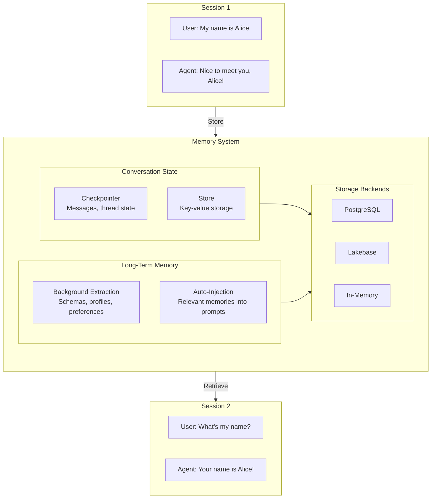
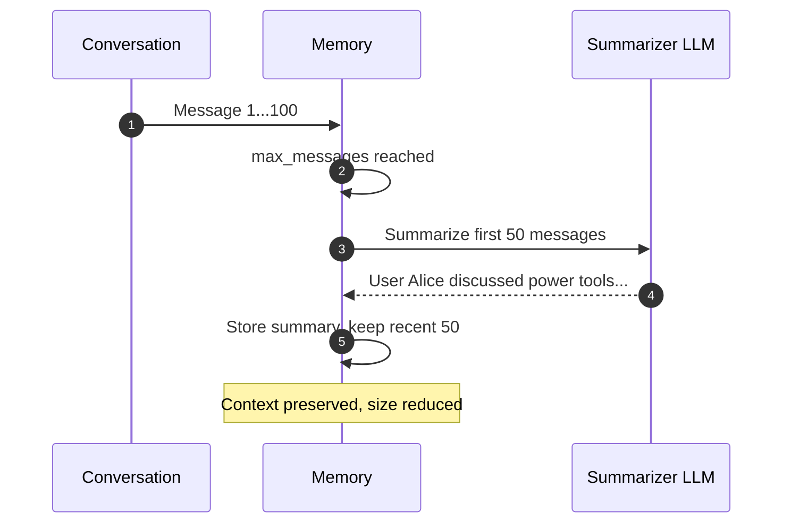

# 05. Memory

**Conversation persistence and long-term memory across sessions**

Store and retrieve conversation history, build user profiles, and extract structured memories for personalized responses.

## Architecture Overview



## Examples

| File | Backend | Description |
|------|---------|-------------|
| [`in_memory_basic.yaml`](./in_memory_basic.yaml) | In-Memory | No persistence, good for testing |
| [`postgres_persistence.yaml`](./postgres_persistence.yaml) | PostgreSQL | Production-ready persistence |
| [`lakebase_persistence.yaml`](./lakebase_persistence.yaml) | Lakebase | Databricks-native persistence with Unity Catalog |
| [`conversation_summarization.yaml`](./conversation_summarization.yaml) | Lakebase | Long conversation summarization with store |

## Memory Components

DAO memory has two layers:

### Conversation State (Checkpointer + Store)

Maintains message history and thread state within a conversation. The **checkpointer** saves conversation messages; the **store** provides key-value storage for metadata and summaries.

```yaml
memory:
  checkpointer:
    name: conversation_checkpointer
    type: lakebase               # or postgres, memory
    schema: *my_schema
    table_name: agent_checkpoints

  store:
    name: memory_store
    type: lakebase
    schema: *my_schema
    table_name: agent_store
    embedding_model: *embedding_model
```

### Long-Term Memory (Extraction)

Automatically extracts and consolidates memories from conversations using structured schemas. Memories persist across sessions and enable personalized responses.

**Structured schemas** define what to remember:

| Schema | Type | Description |
|--------|------|-------------|
| `user_profile` | Profile (single doc per user) | Name, role, expertise, communication style, goals |
| `preference` | Collection (multiple per user) | Individual preferences with category and context |
| `episode` | Collection (multiple per user) | Interaction patterns with situation, approach, outcome |

**Background extraction** runs after each conversation turn in a separate thread, adding zero latency to responses.

**Auto-injection** searches for relevant memories before each model call and injects them into the system prompt, so the agent always has personalized context.

```yaml
memory:
  store:
    name: memory_store
    type: lakebase
    schema: *my_schema
    table_name: agent_store
    embedding_model: *embedding_model

  extraction:
    schemas:
      - user_profile
      - preference
      - episode
    instructions: |
      Extract the user's name, role, preferences, and any notable
      interaction patterns. Update the user profile with new information.
    auto_inject: true             # Inject relevant memories into prompts
    auto_inject_limit: 5          # Max memories to inject per turn
    background_extraction: true   # Extract in background thread
```

## Backend Comparison

| Backend | Persistence | Best For | Requirements |
|---------|-------------|----------|--------------|
| In-Memory | None (lost on restart) | Testing, development | None |
| PostgreSQL | Durable | Production with existing PostgreSQL | PostgreSQL server, connection string |
| Lakebase | Durable | Production on Databricks | Unity Catalog schema |

## In-Memory Configuration

```yaml
memory:
  checkpointer:
    name: conversation_checkpointer
    type: memory
```

## PostgreSQL Configuration

```yaml
memory:
  checkpointer:
    name: conversation_checkpointer
    type: postgres
    database: *postgres_db
  store:
    name: memory_store
    type: postgres
    database: *postgres_db
    embedding_model: *embedding_model
```

## Lakebase Configuration

```yaml
memory:
  checkpointer:
    name: conversation_checkpointer
    type: lakebase
    schema: *my_schema
    table_name: agent_checkpoints
  store:
    name: memory_store
    type: lakebase
    schema: *my_schema
    table_name: agent_store
    embedding_model: *embedding_model
```

## Conversation Summarization

When conversations grow long, the summarizer compresses older messages into a summary to keep context within model limits.



```yaml
memory:
  summarizer:
    model: *default_llm     # LLM for summarization
    max_messages: 100       # Trigger summarization at 100 messages
```

## Memory Tools

When a `store` is configured, agents automatically receive memory tools:

| Tool | Description |
|------|-------------|
| `manage_memory` | Agent-driven CRUD on memory items (create, update, delete) |
| `search_memory` | Semantic search over stored memories |
| `search_user_profile` | Direct lookup of the user's consolidated profile (when `user_profile` schema is configured) |

## Quick Start

```bash
# In-memory (testing)
dao-ai chat -c config/examples/05_memory/in_memory_basic.yaml \
  --thread-id my_session

# PostgreSQL (production)
dao-ai chat -c config/examples/05_memory/postgres_persistence.yaml \
  --thread-id user_123

# Lakebase (Databricks-native)
dao-ai chat -c config/examples/05_memory/lakebase_persistence.yaml \
  --thread-id user_123
```

**Test conversation memory:**
```
> My name is Alice
Nice to meet you, Alice!

> [quit and restart with same thread-id]

> What's my name?
Your name is Alice!
```

**Test long-term memory (with extraction configured):**
```
> I prefer detailed technical explanations
Noted! I'll provide thorough technical details in my responses.

> [new session, different thread-id, same user-id]

> How does memory work?
[Agent responds with detailed technical explanation, remembering the preference]
```

## Thread ID Usage

| Pattern | Use Case |
|---------|----------|
| `user_123` | Per-user conversation history |
| `session_abc` | Per-session history |
| `project_xyz` | Per-project history |

## Troubleshooting

| Issue | Solution |
|-------|----------|
| Memory not persisting | Check database config, verify connection |
| PostgreSQL connection failed | Verify host, port, credentials |
| Context lost between sessions | Ensure same `thread_id` across sessions |
| Long-term memories not appearing | Verify `extraction` config and that `store` has an `embedding_model` |
| Background extraction not running | Set `background_extraction: true` in `extraction` config |

## Next Steps

- **13_orchestration/** - Combine with multi-agent patterns
- **07_human_in_the_loop/** - Stateful approval workflows
- **15_complete_applications/** - Production memory patterns

## Related Documentation

- [Key Capabilities: Memory & State Persistence](../../../docs/key-capabilities.md#7-memory--state-persistence)
- [Configuration Reference: Memory](../../../docs/configuration-reference.md)
- [Orchestration](../13_orchestration/README.md)
