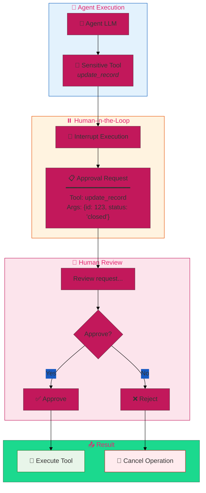
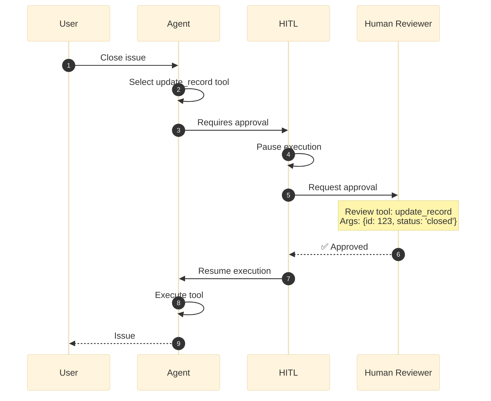
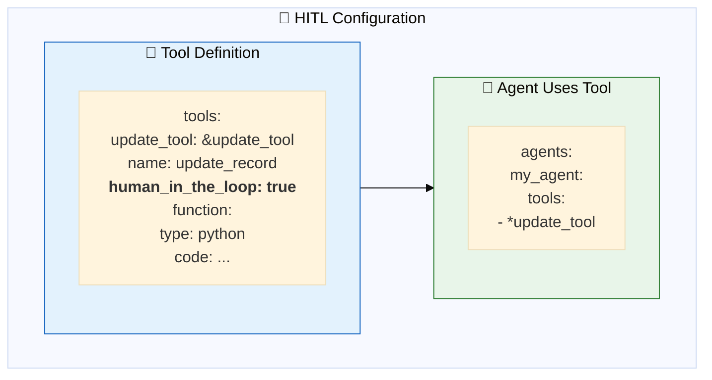
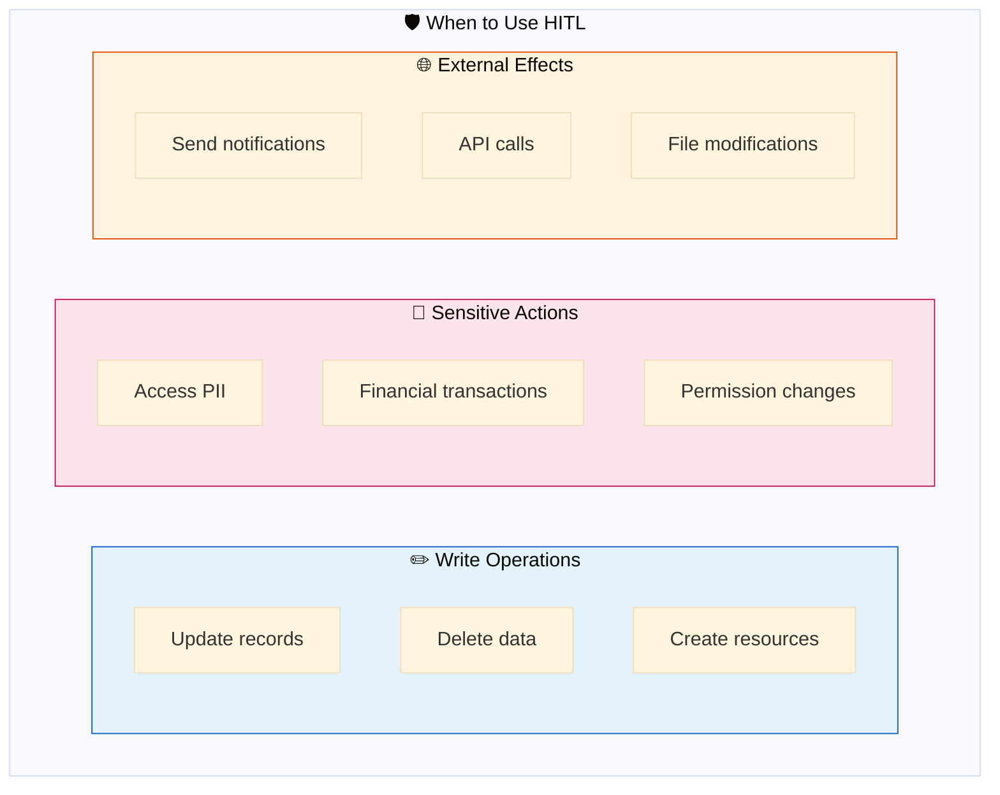
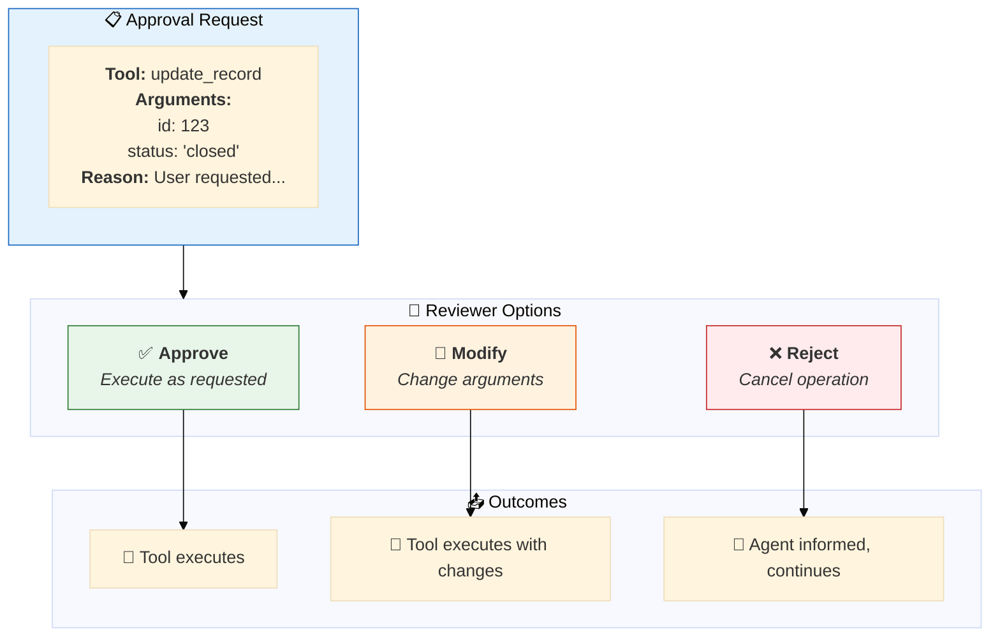
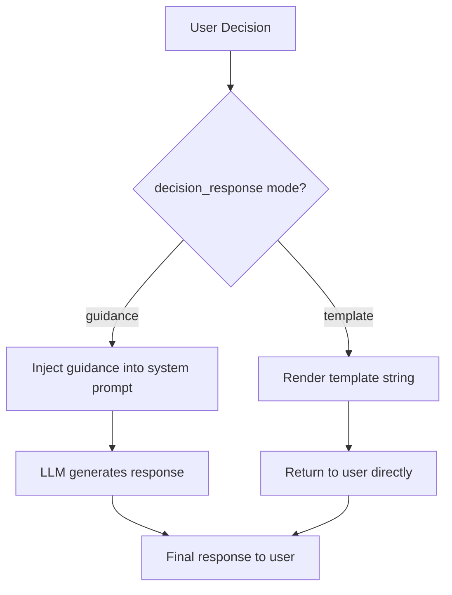
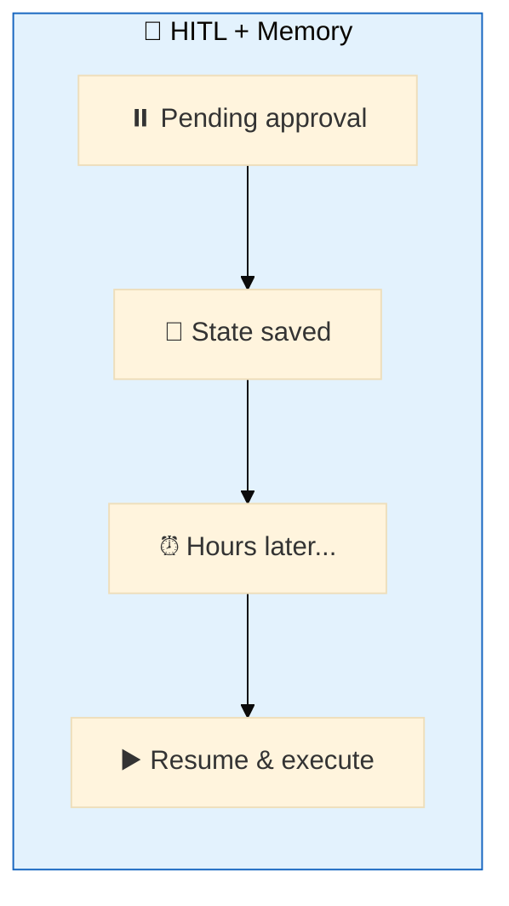
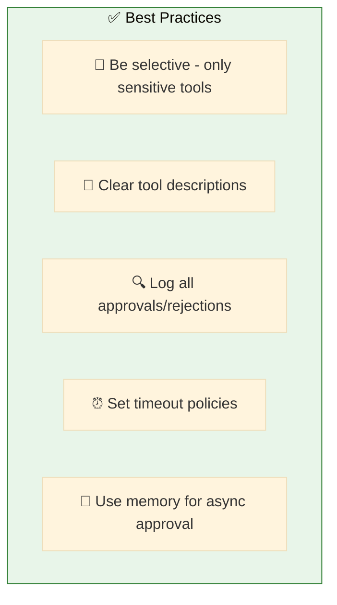

# 07. Human-in-the-Loop (HITL)

**Require human approval for sensitive operations**

Pause agent execution to request human confirmation before executing critical actions.

## Architecture Overview



## Examples

| File | Description |
|------|-------------|
| [`hitl_tools.yaml`](./hitl_tools.yaml) | Tool-level approval for sensitive operations |

## How HITL Works



## Configuration



```yaml
tools:
  # 🔓 Safe tool - no approval needed
  search_tool: &search_tool
    name: search_records
    function:
      type: python
      code: |
        def search_records(query: str):
            return {"results": [...]}

  # 🔒 Sensitive tool - requires approval
  update_tool: &update_tool
    name: update_record
    human_in_the_loop: true       # ← Requires human approval
    function:
      type: python
      code: |
        def update_record(id: int, status: str):
            return {"updated": id, "status": status}

agents:
  assistant: &assistant
    tools:
      - *search_tool     # ✅ Executes immediately
      - *update_tool     # ⏸️ Pauses for approval
```

## HITL Patterns



## Approval Flow



## Decision Response

After a human makes a decision, the agent needs to respond. The `decision_response` field controls whether that response is **LLM-generated** (guidance) or a **pre-formatted string** (template).

| Mode | Description | LLM Call? |
|------|-------------|-----------|
| `template` | Python format string returned directly to the user | No |
| `guidance` | Prompt instruction injected into the LLM system prompt | Yes |
| *(omitted)* | Built-in default template used automatically | No |



**Template variables** (all optional): `{tool_name}`, `{decision_type}`, `{tool_args}`, `{result}`

```yaml
tools:
  file_ticket: &file_ticket
    name: file_ticket
    function:
      type: python
      name: my_package.file_ticket
      human_in_the_loop:
        review_prompt: "Review this ticket before filing."
        allowed_decisions: [approve, reject]
        decision_response:
          approve:
            template: "Your ticket has been filed successfully."
          reject:
            guidance: "Explain why the ticket was not filed and suggest alternatives."
          # edit: omitted — uses default template
```

When all decisions use templates, zero additional tokens are added to the system prompt, reducing cost and latency.

## Integration with Memory



For async approval workflows, combine HITL with memory persistence:

```yaml
app:
  orchestration:
    swarm: true
    memory:
      checkpointer:
        type: postgres
        connection_string: "{{secrets/scope/postgres}}"
```

## Quick Start

```bash
dao-ai chat -c config/examples/07_human_in_the_loop/hitl_tools.yaml
```

**Example interaction:**
```
> Close issue #123

⏸️ APPROVAL REQUIRED
Tool: update_record
Arguments: {"id": 123, "status": "closed"}

Approve? [y/n]: y

✅ Issue #123 has been closed.
```

## Best Practices



## Troubleshooting

| Issue | Solution |
|-------|----------|
| Tool executes without approval | Verify `human_in_the_loop: true` |
| Approval state lost | Add memory persistence |
| Too many interrupts | Reduce HITL tools, batch operations |

## Next Steps

- **05_memory/** - Persist approval state
- **08_guardrails/** - Combine with quality controls
- **15_complete_applications/** - Production HITL patterns

## Related Documentation

- [Human-in-the-Loop](../../../docs/key-capabilities.md#human-in-the-loop)
- [Memory Configuration](../05_memory/README.md)
