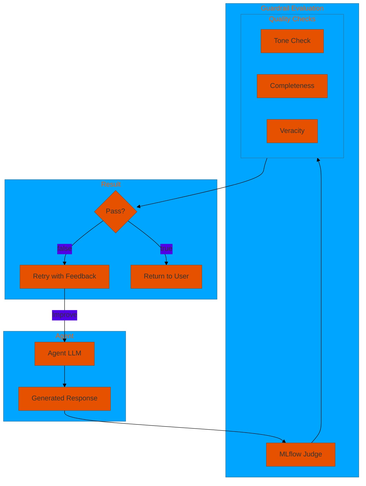
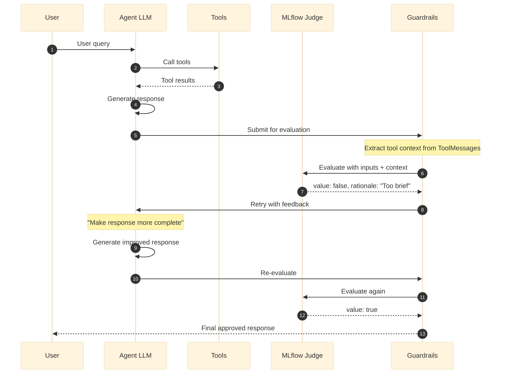

# 08. Guardrails

**MLflow judge-based quality control for agent responses**

Use MLflow judges (`mlflow.genai.judges.make_judge`) to evaluate response quality and automatically retry with feedback when standards aren't met. The **prompt determines the evaluation type** -- tone, completeness, veracity/groundedness, or any custom criteria.

Tool context from `ToolMessage` objects in the conversation (search results, SQL results, Genie responses) is automatically extracted and included in `{{ inputs }}`, enabling veracity checks.

## Architecture Overview



## Examples

| File | Description |
|------|-------------|
| [`guardrails_basic.yaml`](./guardrails_basic.yaml) | MLflow judge-based guardrails with tone, completeness, and veracity checks |

## How Guardrails Work



## Configuration

### 1. Define Guardrail Prompts

Prompts use Jinja2 template variables:
- `{{ inputs }}` -- Contains the user query AND extracted tool context
- `{{ outputs }}` -- Contains the agent's response

```yaml
prompts:
  professional_tone_prompt: &professional_tone_prompt
    schema: *retail_schema
    name: professional_tone_guardrail
    default_template: |
      Evaluate if the response is professional and appropriate.
      
      User Request: {{ inputs }}
      Agent Response: {{ outputs }}
      
      The response should:
      - Use professional language (no slang)
      - Be respectful and courteous
      - Be clear and easy to understand
      
      Rate as true if criteria met, false if not.

  # Veracity prompt -- leverages tool context in {{ inputs }}
  veracity_guardrail_prompt: &veracity_guardrail_prompt
    schema: *retail_schema
    name: veracity_guardrail
    default_template: |
      Evaluate whether the response is grounded in the retrieved context.

      User query and retrieved context: {{ inputs }}
      Agent response: {{ outputs }}

      Rate as true if all claims are grounded, false if any are fabricated.
```

### 2. Define Guardrails

```yaml
guardrails:
  tone_guardrail: &tone_guardrail
    name: tone_check
    model: *judge_llm             # Separate LLM for evaluation
    prompt: *professional_tone_prompt
    num_retries: 2                # Max retries before giving up
  
  completeness_guardrail: &completeness_guardrail
    name: completeness_check
    model: *judge_llm
    prompt: *completeness_guardrail_prompt
    num_retries: 2

  veracity_guardrail: &veracity_guardrail
    name: veracity_check
    model: *judge_llm
    prompt: *veracity_guardrail_prompt
    num_retries: 2
    fail_open: true               # Let responses through if judge fails
```

### 3. Apply to Agents

```yaml
agents:
  general_agent: &general_agent
    name: assistant
    model: *default_llm
    tools:
      - *search_tool
    
    # Apply guardrails to this agent
    guardrails:
      - *tone_guardrail
      - *completeness_guardrail
      - *veracity_guardrail
```

## Specialized Guardrails (Zero-Config)

Specialized guardrails provide built-in expert prompts -- no prompt authoring needed. Configure via the `middleware:` section.

### Veracity Guardrail

Checks if the response is grounded in tool/retrieval context. **Automatically skips** when no tool context is present.

```yaml
middleware:
  veracity_check:
    name: dao_ai.middleware.create_veracity_guardrail_middleware
    args:
      model: "databricks:/databricks-claude-3-7-sonnet"
      num_retries: 2
```

### Relevance Guardrail

Ensures the response directly addresses the user's query. Detects topic drift.

```yaml
middleware:
  relevance_check:
    name: dao_ai.middleware.create_relevance_guardrail_middleware
    args:
      model: "databricks:/databricks-claude-3-7-sonnet"
```

### Tone Guardrail

Validates response tone against a preset profile. Profiles: `professional`, `casual`, `technical`, `empathetic`, `concise`.

```yaml
middleware:
  tone_check:
    name: dao_ai.middleware.create_tone_guardrail_middleware
    args:
      model: "databricks:/databricks-claude-3-7-sonnet"
      tone: professional   # or: casual, technical, empathetic, concise
```

### Conciseness Guardrail

Hybrid deterministic length check + LLM verbosity evaluation. The length check runs first with zero LLM cost.

```yaml
middleware:
  conciseness_check:
    name: dao_ai.middleware.create_conciseness_guardrail_middleware
    args:
      model: "databricks:/databricks-claude-3-7-sonnet"
      max_length: 2000
      min_length: 50
      check_verbosity: true
```

## Guardrail Types Summary

| Type | Config | Prompt Required | Key Feature |
|------|--------|----------------|-------------|
| **Generic** | `guardrails:` section | Yes | Fully customizable evaluation |
| **Veracity** | `middleware:` section | No | Auto-skips when no tool context |
| **Relevance** | `middleware:` section | No | Topic drift detection |
| **Tone** | `middleware:` section | No | Preset profiles (professional, etc.) |
| **Conciseness** | `middleware:` section | No | Hybrid deterministic + LLM |
| **Content Filter** | `middleware:` section | No | Deterministic keyword blocking |
| **Safety** | `middleware:` section | No | Structured safe/unsafe output |

## Configuration Options

### Generic Guardrails (`guardrails:` section)

| Field | Type | Default | Description |
|-------|------|---------|-------------|
| `name` | string | required | Guardrail identifier |
| `model` | string/LLMModel | required | LLM for the MLflow judge |
| `prompt` | string/PromptModel | required | Evaluation instructions with `{{ inputs }}`/`{{ outputs }}` |
| `num_retries` | int | 3 | Max retry attempts |
| `fail_open` | bool | true | Let responses through on judge error |
| `max_context_length` | int | 8000 | Max chars for extracted tool context |

### Specialized Guardrails (`middleware:` section)

| Guardrail | Required Args | Optional Args |
|-----------|---------------|---------------|
| **Veracity** | `model` | `num_retries` (2), `fail_open` (true), `max_context_length` (8000) |
| **Relevance** | `model` | `num_retries` (2), `fail_open` (true) |
| **Tone** | `model` | `tone` ("professional"), `custom_guidelines`, `num_retries` (2), `fail_open` (true) |
| **Conciseness** | `model` | `max_length` (3000), `min_length` (20), `check_verbosity` (true), `num_retries` (2), `fail_open` (true) |

## LLM Configuration

```yaml
resources:
  llms:
    default_llm: &default_llm
      name: databricks-claude-3-7-sonnet
      temperature: 0.7            # Higher for creative responses
      max_tokens: 4096

    judge_llm: &judge_llm
      name: databricks-claude-3-7-sonnet
      temperature: 0.3            # Lower for consistent evaluation
      max_tokens: 2048
```

## Quick Start

```bash
# Run with guardrails
dao-ai chat -c config/examples/08_guardrails/guardrails_basic.yaml

# See guardrail evaluation in logs
dao-ai chat -c config/examples/08_guardrails/guardrails_basic.yaml --log-level DEBUG
```

**Look for in logs:**
- `"Evaluating response with guardrail"` -- Starting evaluation
- `"Response approved by guardrail"` -- Passed
- `"Guardrail requested improvements"` -- Failed, retrying
- `"Guardrail failed - max retries reached"` -- Exhausted retries
- `"Guardrail failing open"` -- Judge error, letting through

## Best Practices

1. **Monitor trigger rates** -- Track how often each guardrail triggers retries
2. **Balance quality vs latency** -- Each retry adds a full model call
3. **Use lower temperature for judge** -- More consistent evaluations
4. **Test edge cases** -- Verify guardrails don't block valid responses
5. **Version prompts in MLflow** -- Track prompt changes over time
6. **Use fail_open: true** -- Prefer availability over strictness for most use cases
7. **Combine with offline evaluation** -- Use `create_veracity_scorer` for thorough trace-based evaluation

## Troubleshooting

| Issue | Solution |
|-------|----------|
| Too many retries | Improve agent prompt, reduce strictness |
| Guardrails never trigger | Check prompt scoring criteria |
| High latency | Reduce num_retries, use faster judge model |
| Inconsistent evaluation | Lower judge temperature |
| Judge errors | Check model endpoint availability, verify fail_open setting |

## Next Steps

- **11_prompt_engineering/** - Optimize guardrail prompts
- **12_middleware/** - Combine with other middleware
- **15_complete_applications/** - See guardrails in production

## Related Documentation

- [Guardrails Configuration](../../../docs/key-capabilities.md#guardrails)
- [Prompt Engineering](../11_prompt_engineering/README.md)
