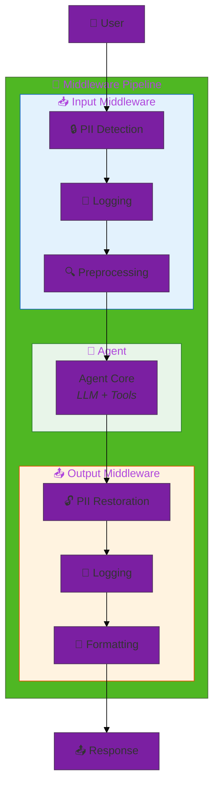
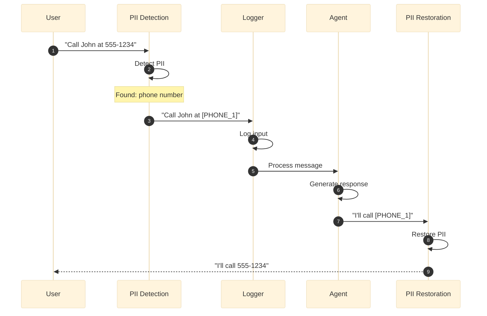
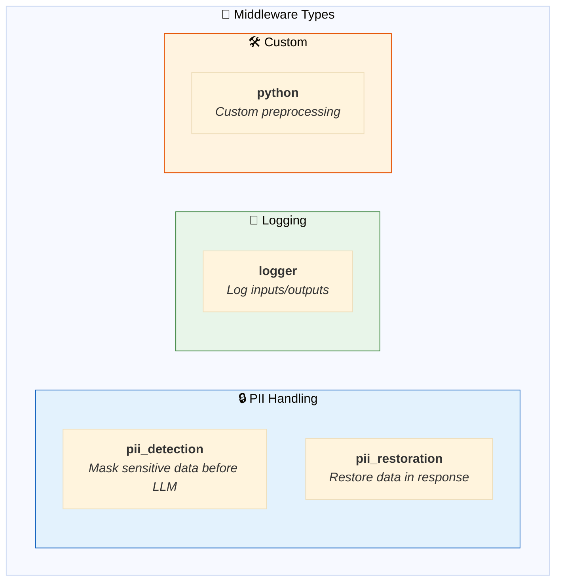
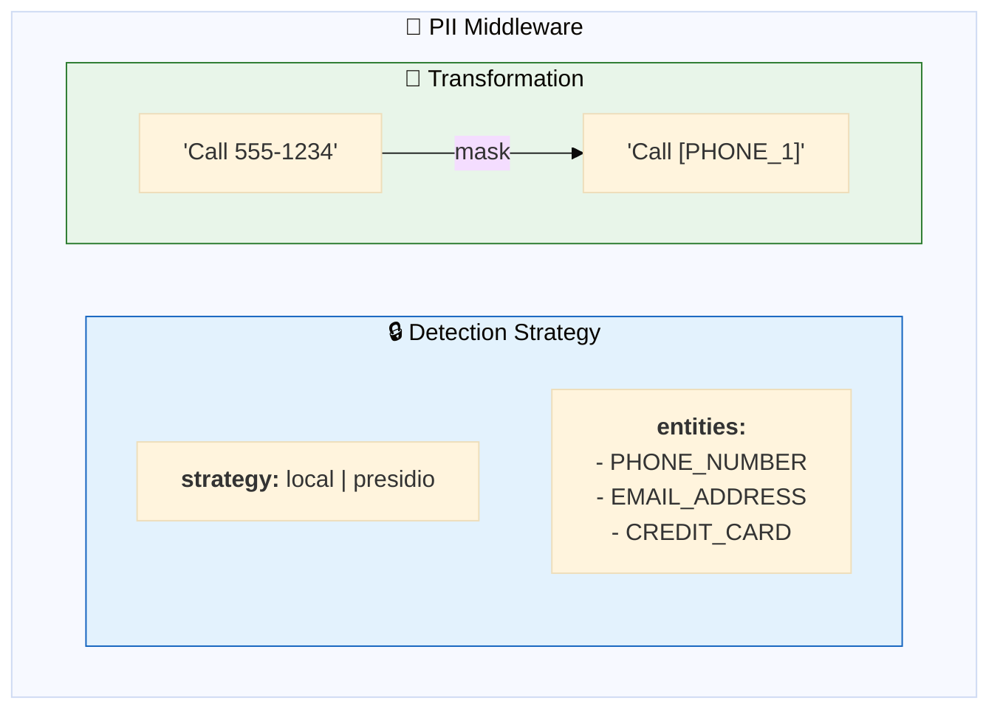
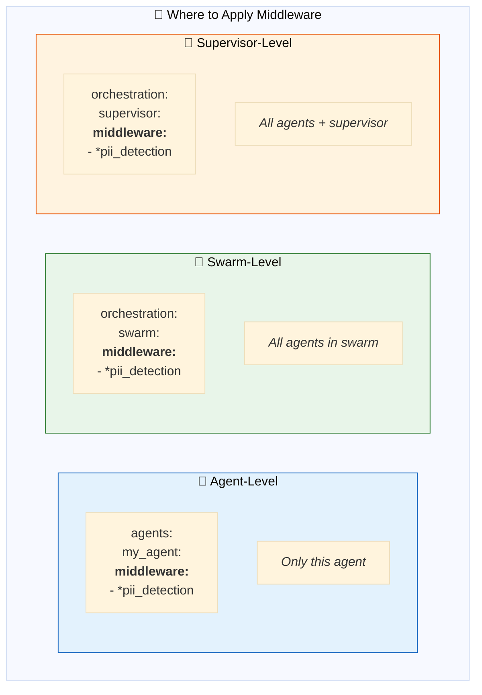
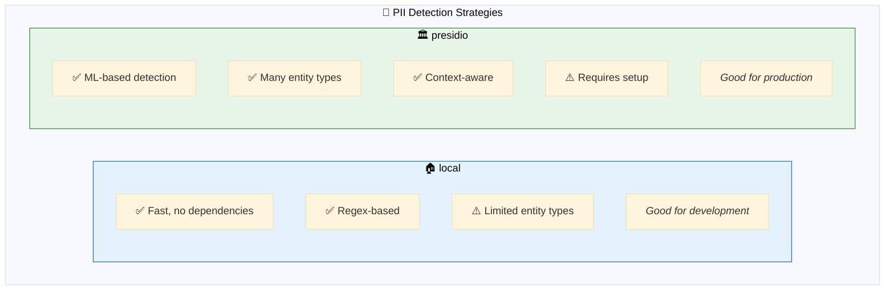
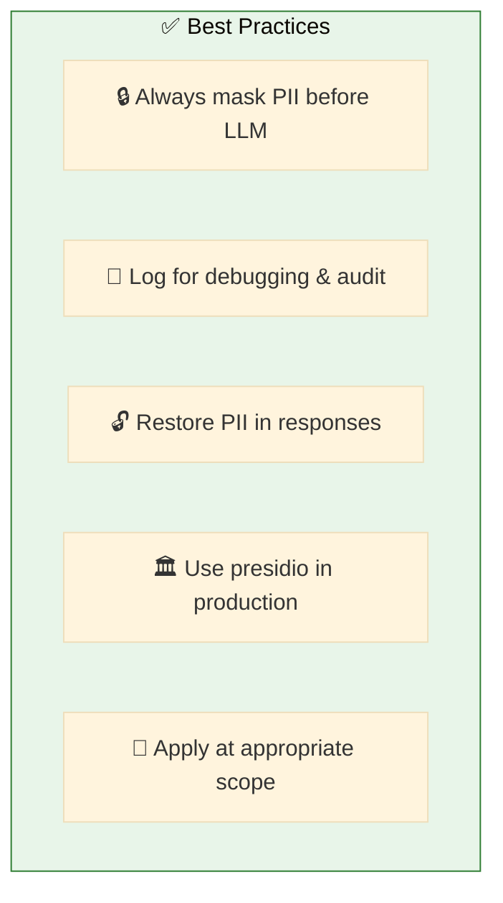

# 12. Middleware

**Cross-cutting concerns for agent pipelines**

Apply preprocessing, logging, PII handling, and other transformations to agent inputs and outputs.

## Architecture Overview



## Examples

| File | Description |
|------|-------------|
| [`middleware_basic.yaml`](./middleware_basic.yaml) | PII detection and logging middleware |
| [`middleware_advanced.yaml`](./middleware_advanced.yaml) | Custom preprocessing and formatting |
| [`deepagents_middleware.yaml`](./deepagents_middleware.yaml) | Deep Agents middleware (todo, filesystem, subagent, skills, memory, summarization) |

## Middleware Execution Flow



## Middleware Types



## PII Detection Configuration



```yaml
middleware:
  pii_detection: &pii_detection
    type: pii_detection
    strategy: local                # or 'presidio' for production
    entities:
      - PHONE_NUMBER
      - EMAIL_ADDRESS
      - CREDIT_CARD
      - US_SSN
```

## Complete Configuration

```yaml
middleware:
  # 🔒 PII Detection - mask before LLM
  pii_detection: &pii_detection
    type: pii_detection
    strategy: local
    entities:
      - PHONE_NUMBER
      - EMAIL_ADDRESS
      - CREDIT_CARD

  # 🔓 PII Restoration - restore in response
  pii_restoration: &pii_restoration
    type: pii_restoration
    strategy: local

  # 📝 Logging
  logger: &logger
    type: logger
    level: INFO

agents:
  assistant: &assistant
    name: assistant
    middleware:                    # Applied to this agent
      - *pii_detection
      - *logger
      - *pii_restoration

app:
  orchestration:
    swarm:
      middleware:                  # Applied to all agents
        - *pii_detection
        - *pii_restoration
```

## Middleware Scopes



## PII Detection Strategies



## Custom Middleware

```yaml
middleware:
  custom_preprocessor:
    type: python
    code: |
      def preprocess(message: str) -> str:
          # Custom preprocessing logic
          return message.strip().lower()
      
      def postprocess(response: str) -> str:
          # Custom postprocessing logic
          return response.capitalize()
```

## Quick Start

```bash
# Basic middleware
dao-ai chat -c config/examples/12_middleware/middleware_basic.yaml

# Test PII handling
> Call me at 555-123-4567

# Agent sees: "Call me at [PHONE_1]"
# Response restores: "I'll call 555-123-4567"
```

## Best Practices



## Troubleshooting

| Issue | Solution |
|-------|----------|
| PII not detected | Check entity types, try presidio |
| PII not restored | Ensure restoration middleware after agent |
| Performance issues | Use local strategy, reduce entities |

## Deep Agents Middleware

DAO AI integrates with the [Deep Agents](https://pypi.org/project/deepagents/) library to provide advanced agent middleware through simple factory functions. All factories are configurable via YAML using `name` + `args`.

### Available Factories

| Factory | Module | Description |
|---------|--------|-------------|
| `create_todo_list_middleware` | `dao_ai.middleware.todo` | Task planning via `write_todos` tool |
| `create_filesystem_middleware` | `dao_ai.middleware.filesystem` | File operations (ls, read, write, edit, grep, glob) |
| `create_subagent_middleware` | `dao_ai.middleware.subagent` | Spawn isolated subagents via `task` tool |
| `create_skills_middleware` | `dao_ai.middleware.skills` | SKILL.md discovery with progressive disclosure |
| `create_agents_memory_middleware` | `dao_ai.middleware.memory_agents` | AGENTS.md context loading |
| `create_deep_summarization_middleware` | `dao_ai.middleware.summarization` | Enhanced summarization with backend offloading |

### Backend Types

Middleware that use file storage accept a `backend_type` argument:

| Backend | Description | Required Args |
|---------|-------------|---------------|
| `state` (default) | Ephemeral storage in LangGraph state | None |
| `filesystem` | Real disk storage | `root_dir` |
| `store` | Persistent via LangGraph Store | None |
| `volume` | Databricks Unity Catalog Volume | `volume_path` |

### Subagent Model

The `model` field in each subagent spec accepts a string (`"openai:gpt-4o-mini"`) **or** an LLMModel dict that is automatically converted to a `ChatDatabricks` instance:

```yaml
subagents:
  - name: analyst
    model:                                   # Dict -> ChatDatabricks
      name: "databricks-meta-llama-3-3-70b-instruct"
      temperature: 0.1
```

In Python code you can also pass `LLMModel(...)` or `ChatDatabricks(...)` directly.

### Quick Example

```yaml
middleware:
  todo: &todo
    name: dao_ai.middleware.todo.create_todo_list_middleware

  filesystem: &filesystem
    name: dao_ai.middleware.filesystem.create_filesystem_middleware

  # Volume backend for Databricks
  filesystem_volume: &filesystem_volume
    name: dao_ai.middleware.filesystem.create_filesystem_middleware
    args:
      backend_type: volume
      volume_path: /Volumes/catalog/schema/agent_workspace

agents:
  my_agent:
    middleware:
      - *todo
      - *filesystem
```

See [`deepagents_middleware.yaml`](./deepagents_middleware.yaml) for a complete example.

## Next Steps

- **08_guardrails/** - Combine with quality controls
- **13_orchestration/** - Apply to multi-agent systems
- **15_complete_applications/** - Production middleware patterns

## Related Documentation

- [Middleware Configuration](../../../docs/key-capabilities.md#middleware)
- [PII Handling](../../../docs/architecture.md#pii-handling)
