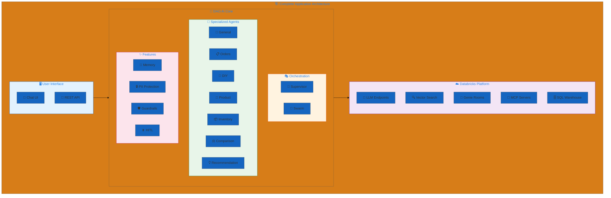
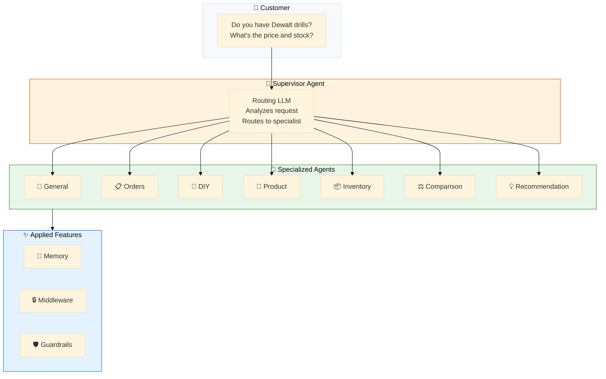
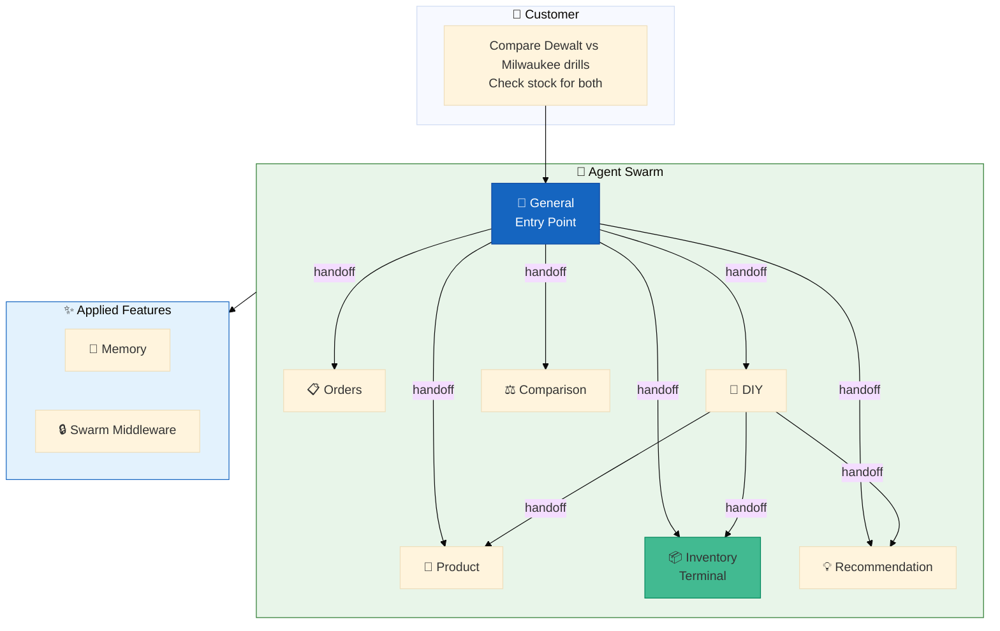
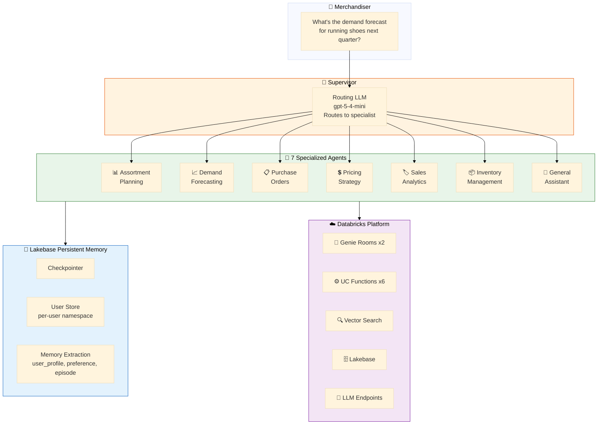
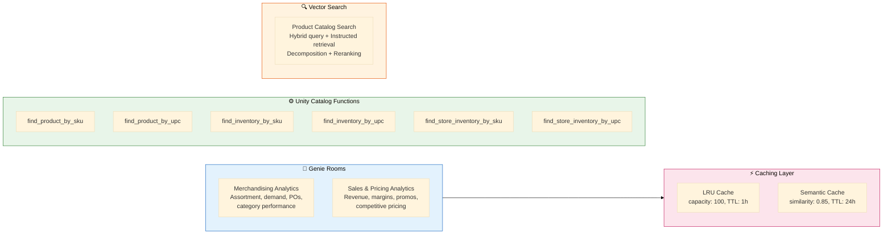
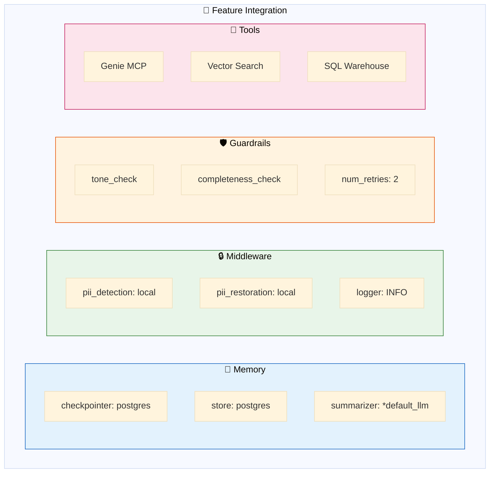
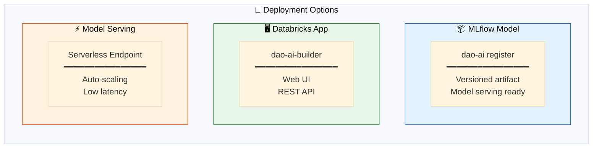
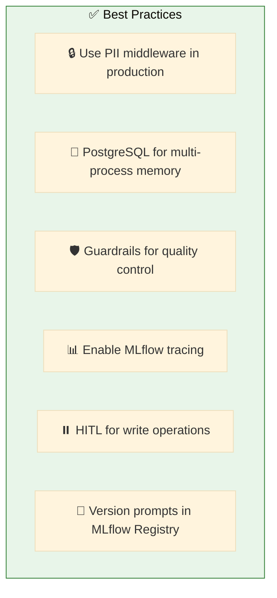

# 15. Complete Applications

**Production-ready examples combining multiple features**

End-to-end configurations demonstrating best practices for real-world deployments.

## Architecture Overview



## Examples

| File | Pattern | Description |
|------|---------|-------------|
| [`hardware_store.yaml`](./hardware_store.yaml) | 👔 Supervisor | Multi-agent supervisor with full features |
| [`hardware_store_swarm.yaml`](./hardware_store_swarm.yaml) | 🐝 Swarm | Swarm orchestration with handoffs |
| [`hardware_store_lakebase.yaml`](./hardware_store_lakebase.yaml) | 👔 Supervisor + 🧠 Lakebase | Supervisor with PostgreSQL memory persistence |
| [`hardware_store_instructed.yaml`](./hardware_store_instructed.yaml) | 🎯 Instructed | Hardware store with instructed retrieval |
| [`sporting_goods_store.yaml`](./sporting_goods_store.yaml) | 👔 Supervisor + 🧠 Lakebase | Merchandiser 360 multi-agent system for sporting goods lifecycle management |

## Hardware Store Supervisor Architecture



## Hardware Store Swarm Architecture



**Swarm Handoff Configuration:**
- **General** (blue, entry point): Can handoff to any agent
- **DIY**: Can handoff to product, inventory, recommendation
- **Inventory** (green): Terminal agent with no outbound handoffs

---

## Sporting Goods Store - Merchandiser 360

A multi-agent system for sporting goods merchandising lifecycle management. Covers the full merchandiser workflow: assortment planning, demand forecasting, purchase orders, pricing strategy, sales analytics, and inventory management across categories like athletic footwear, apparel, team sports, fitness equipment, outdoor/camping, cycling, golf, and accessories.

### Merchandiser 360 Architecture



### Agents

| Agent | Description | Tools |
|-------|-------------|-------|
| **Assortment Planning** | Category mix, planogram strategy, seasonal transitions, product lifecycle | Genie (Merchandising Analytics), Vector Search |
| **Demand Forecasting** | Sales predictions, trend analysis, seasonal demand, stockout risk | Genie (Merchandising Analytics), Current Time |
| **Purchase Orders** | PO lifecycle, vendor relations, buying decisions, receiving | Genie (Merchandising Analytics), find_inventory_by_sku |
| **Pricing Strategy** | Markdowns, promotions, competitive pricing, clearance, margin analysis | Genie (Sales & Pricing), find_product_by_sku, find_product_by_upc |
| **Sales Analytics** | Store comparisons, revenue tracking, department sales, return analysis | Genie (Sales & Pricing), find_inventory_by_sku, Vector Search |
| **Inventory Management** | Stock levels, replenishment, allocation, store-level availability | find_inventory_by_sku/upc, find_store_inventory_by_sku/upc, Vector Search |
| **General Assistant** | Product information, store inquiries, general questions | Vector Search |

### Tools and Data Sources



### Key Features

- **Lakebase Persistent Memory** -- Checkpointer for conversation state, per-user namespace store, and background memory extraction across three schemas (`user_profile`, `preference`, `episode`). Memories are auto-injected into agent context (limit: 5).
- **Instructed Retrieval** -- Vector search with query decomposition into up to 3 sub-queries, Reciprocal Rank Fusion (RRF, k=60) for merging, normalized filter case (uppercase), and LLM-based reranking with domain-specific instructions.
- **Genie Caching** -- Dual-layer caching on both Genie rooms: LRU cache (100 capacity, 1h TTL) plus context-aware semantic cache via Lakebase (0.85 similarity threshold, 24h TTL). Persistent conversation history enabled.
- **Monitoring** -- Built-in scorers (`safety`, `completeness`, `relevance_to_query`, `tool_call_efficiency`) at 100% sample rate, plus custom guideline scorers at 50% (`merchandising_accuracy`, `tool_usage_quality`, `response_professionalism`).
- **MLflow Prompt Registry** -- 7 auto-registered prompts with `environment` and `domain` tags. Each agent prompt is versioned and managed through MLflow Prompt Registry.
- **Middleware** -- Store number field validation (`store_num`) ensures inventory and sales lookups are scoped to the correct location.
- **Evaluation** -- 25 auto-generated eval questions with merchandising-specific guidelines covering all 7 agent specializations and multiple user personas (merchandiser, buyer, pricing analyst, store manager, demand planner).
- **Service Principal** -- Dedicated `retail_consumer_goods_sp` service principal with secrets managed via Unity Catalog scopes.
- **LLM Fallbacks** -- Tool-calling LLM configured with automatic fallback (`claude-sonnet-4-6` -> `claude-sonnet-4-5`).

### Datasets

| Table | Description |
|-------|-------------|
| `products` | Product catalog with SKU, UPC, brand, sport category, pricing, and descriptions |
| `inventory` | Stock levels across all stores and warehouses |
| `dim_stores` | Store dimension table with location and attributes |
| `sales_orders` | Sales transaction history |
| `purchase_orders` | Purchase order records with vendor and status tracking |
| `pricing_history` | Historical pricing changes, markdowns, and promotions |

All tables live in `retail_consumer_goods.sporting_goods_store` within Unity Catalog.

### Quick Start

```bash
# Validate the sporting goods store configuration
dao-ai validate -c config/examples/15_complete_applications/sporting_goods_store.yaml

# Run in chat mode
dao-ai chat -c config/examples/15_complete_applications/sporting_goods_store.yaml

# Visualize the multi-agent architecture
dao-ai graph -c config/examples/15_complete_applications/sporting_goods_store.yaml -o sporting_goods_architecture.png

# Deploy to Databricks
dao-ai bundle --deploy -c config/examples/15_complete_applications/sporting_goods_store.yaml
```

### Sample Prompts

- "What Nike running shoes do we carry?"
- "What's the demand forecast for running shoes next quarter?"
- "Show me open purchase orders from Nike"
- "What are our margin targets for footwear?"
- "How are trail running shoes performing this month?"
- "What's the stock level on SKU NKE-RUN-001?"

---

## Feature Integration



## Production Checklist

```mermaid
%%{init: {'theme': 'base'}}%%
flowchart TB
    subgraph Checklist["✅ Production Checklist"]
        subgraph Security["🔐 Security"]
            S1["☐ PII middleware enabled"]
            S2["☐ Secrets in Unity Catalog"]
            S3["☐ HITL for sensitive ops"]
        end
        
        subgraph Reliability["🔄 Reliability"]
            R1["☐ PostgreSQL memory"]
            R2["☐ Guardrails configured"]
            R3["☐ Error handling"]
        end
        
        subgraph Observability["📊 Observability"]
            O1["☐ MLflow tracing"]
            O2["☐ Logging middleware"]
            O3["☐ Metrics collection"]
        end
        
        subgraph Scale["📈 Scale"]
            SC1["☐ Load testing"]
            SC2["☐ Rate limiting"]
            SC3["☐ Model registration"]
        end
    end

    style Security fill:#ffebee,stroke:#c62828
    style Reliability fill:#e8f5e9,stroke:#2e7d32
    style Observability fill:#e3f2fd,stroke:#1565c0
    style Scale fill:#fff3e0,stroke:#e65100
```



## Configuration Structure

```yaml
# Complete Application Structure
schemas:
  retail_schema: &retail_schema           # Unity Catalog location

resources:
  llms:
    default_llm: &default_llm             # Primary LLM
    judge_llm: &judge_llm                 # Guardrail evaluator
  vector_stores:
    products_store: &products_store       # Semantic search
  genie_rooms:
    retail_genie: &retail_genie           # Natural language SQL

prompts:
  tone_prompt: &tone_prompt               # Guardrail prompts
  agent_prompts: ...                      # Agent instructions

middleware:
  pii_detection: &pii_detection           # Input protection
  pii_restoration: &pii_restoration       # Output restoration
  logger: &logger                         # Audit logging

guardrails:
  tone_check: &tone_check                 # Response quality
  completeness_check: &completeness_check

tools:
  genie_tool: &genie_tool                 # Data queries
  vector_tool: &vector_tool               # Semantic search
  handoff_tools: ...                      # For swarm pattern

agents:
  general_agent: &general_agent         # General store inquiries
  orders_agent: &orders_agent           # Order tracking
  diy_agent: &diy_agent                 # DIY advice & tutorials
  product_agent: &product_agent         # Product details
  inventory_agent: &inventory_agent     # Stock levels
  comparison_agent: &comparison_agent   # Product comparisons
  recommendation_agent: &recommendation_agent  # Product suggestions

app:
  name: hardware_store_assistant
  agents:
    - *general_agent
    - *orders_agent
    - *diy_agent
    - *product_agent
    - *inventory_agent
    - *comparison_agent
    - *recommendation_agent
  orchestration:
    supervisor:                           # or swarm:
      model: *default_llm
      prompt: "Route to appropriate agent..."
      middleware: [*pii_detection, *pii_restoration]
    memory:
      checkpointer:
        type: postgres
        connection_string: "{{secrets/scope/postgres}}"
```

## Quick Start

```bash
# Validate complete application
dao-ai validate -c config/examples/15_complete_applications/hardware_store.yaml

# Run in chat mode
dao-ai chat -c config/examples/15_complete_applications/hardware_store.yaml

# Visualize architecture
dao-ai graph -c config/examples/15_complete_applications/hardware_store.yaml -o architecture.png

# Deploy to Databricks
dao-ai bundle --deploy -c config/examples/15_complete_applications/hardware_store.yaml
```

## Deployment Options



## Best Practices



## Troubleshooting

| Issue | Solution |
|-------|----------|
| Memory not persisting | Check PostgreSQL connection |
| Slow responses | Review guardrail num_retries |
| Wrong agent routing | Improve supervisor prompt |
| PII leaking | Verify middleware order |

## Related Documentation

- [Architecture Overview](../../../docs/architecture.md)
- [Configuration Reference](../../../docs/configuration-reference.md)
- [Deployment Guide](../../../docs/deployment.md)
