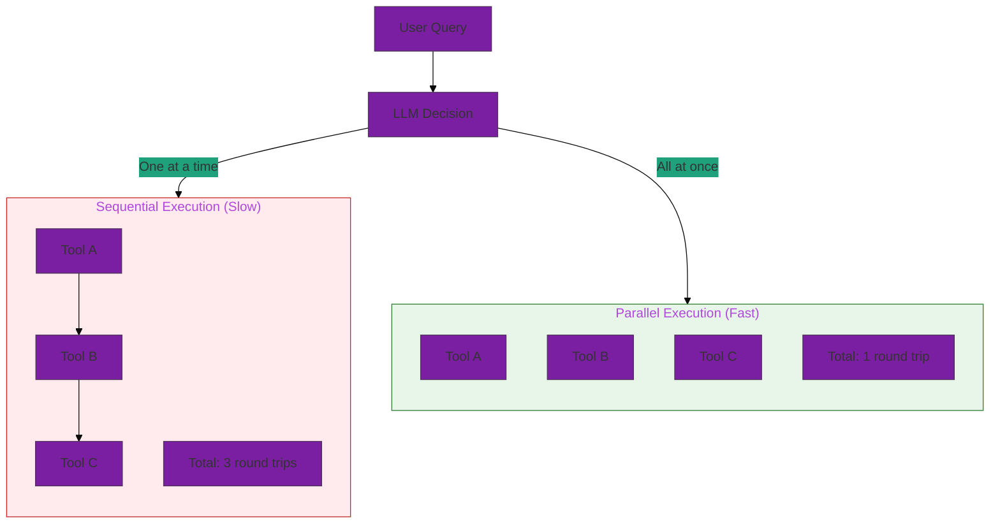
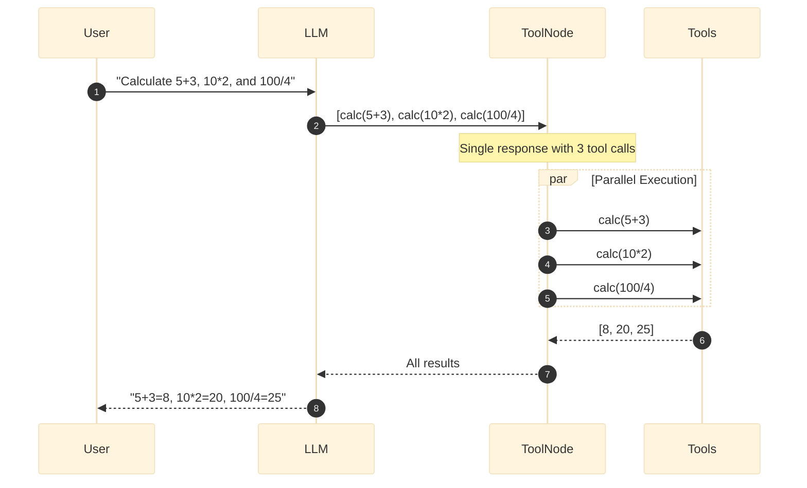
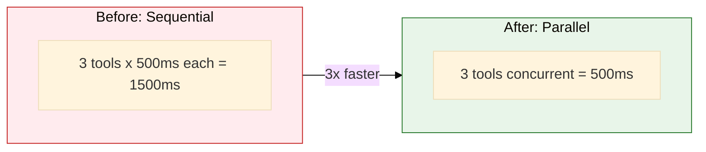

# 17. Parallel Tool Calls

**Maximize agent performance with concurrent tool execution**

Learn how to enable and observe parallel tool calling, where the LLM requests multiple tools in a single response and they execute concurrently.

## Architecture Overview



## Examples

| File | Description |
|------|-------------|
| [`parallel_tool_calls.yaml`](./parallel_tool_calls.yaml) | Complete example with inline tools and observability middleware |

## Key Concepts

### 1. Parallel Tool Calling

When an LLM needs multiple pieces of independent information, it can request all tools in a single response:



### 2. Inline Tool Definitions

Define simple tools directly in YAML without separate Python files:

```yaml
tools:
  calculator:
    name: calculator
    function:
      type: inline
      code: |
        from langchain.tools import tool

        @tool
        def calculator(expression: str) -> str:
            """Evaluate a mathematical expression."""
            return str(eval(expression))
```

### 3. Tool Call Observability

Monitor parallel vs sequential tool calling patterns:

```yaml
middleware:
  - name: dao_ai.middleware.tool_call_observability.create_tool_call_observability_middleware
    args:
      log_level: INFO
      include_args: true
```

## Prompt Engineering for Parallel Calls

The key to enabling parallel tool calls is **explicit instruction** in the system prompt:

```yaml
prompt: |
  You are a helpful assistant with access to various tools.

  ## CRITICAL: Parallel Tool Execution

  **ALWAYS call multiple tools simultaneously when they are independent.**

  When you need to perform multiple independent operations, you MUST call ALL
  relevant tools in a SINGLE response. Do NOT call them one at a time.

  Examples of CORRECT parallel behavior:
  - User asks for time in 3 cities -> Call get_time 3 times IN ONE RESPONSE
  - User asks for 3 calculations -> Call calculator 3 times IN ONE RESPONSE
  - User asks to look up items 101, 102, 103 -> Call lookup 3 times IN ONE RESPONSE

  Only call tools sequentially when one tool's output is needed as INPUT for another.
```

## Observability Output

The observability middleware provides detailed logging:

### Parallel Calls Detected
```
INFO | PARALLEL tool calls detected | num_tools=3 | tool_names=calculator,calculator,calculator
INFO |   Tool: calculator | args={'expression': '5 + 3'}
INFO |   Tool: calculator | args={'expression': '10 * 2'}
INFO |   Tool: calculator | args={'expression': '100 / 4'}
```

### Summary Statistics
```
INFO | Tool Call Observability Summary
     | total_model_calls=2
     | total_tool_calls=3
     | parallel_batches=1
     | sequential_calls=0
     | parallelism_ratio=100.0%

SUCCESS | Parallel tool calling IS happening: 1 batches with multiple tools
```

### Sequential Calls Warning
```
WARNING | All tool calls are SEQUENTIAL: 5 single-tool responses.
        | Consider prompt engineering to encourage parallel calls.
```

## Quick Start

```bash
# Run the parallel tool calls example
dao-ai chat -c config/examples/17_parallel_tools/parallel_tool_calls.yaml

# Test queries that should trigger parallel calls:
> What is 5+3, 10*2, and 100/4?
> Look up items 101, 102, and 201
> Roll three dice for me
```

## Performance Benefits



| Scenario | Sequential | Parallel | Speedup |
|----------|------------|----------|---------|
| 3 independent lookups | 1.5s | 0.5s | 3x |
| 5 API calls | 2.5s | 0.5s | 5x |
| 10 database queries | 5.0s | 0.5s | 10x |

## Inline Tools Reference

The `inline` function type allows defining tools directly in YAML:

```yaml
tools:
  my_tool:
    name: my_tool
    function:
      type: inline
      code: |
        from langchain.tools import tool

        @tool
        def my_tool(param: str) -> str:
            """Tool description shown to the LLM."""
            # Your tool logic here
            return f"Result: {param}"
```

### Requirements

- Must import `@tool` decorator from `langchain.tools`
- Must define at least one function decorated with `@tool`
- The function docstring becomes the tool description
- Return type should be `str` for best compatibility

### Use Cases

- Prototyping and testing
- Simple utility tools
- Demo configurations
- Learning and experimentation

For production tools, consider using `type: python` or `type: factory` with proper module organization.

## Troubleshooting

| Issue | Solution |
|-------|----------|
| Tools called sequentially | Add explicit parallel instructions to prompt |
| Model ignores parallel prompt | Try more emphatic wording, use examples |
| Observability not logging | Ensure middleware is first in list |
| Inline tool errors | Check imports and `@tool` decorator |

## Best Practices

1. **Prompt Engineering**: Explicitly instruct the model to batch independent operations
2. **Observability**: Always add the observability middleware during development
3. **Test Queries**: Use queries that naturally require multiple independent operations
4. **Monitor Parallelism Ratio**: Aim for high parallelism ratio in your use cases

## Next Steps

- **12_middleware/** - Learn about other middleware options
- **14_basic_tools/** - Explore tool definition patterns
- **15_complete_applications/** - See parallel tools in production configs

## Related Documentation

- [Tool Configuration](../../../docs/key-capabilities.md#tools)
- [Middleware Configuration](../../../docs/key-capabilities.md#middleware)
- [Performance Optimization](../../../docs/architecture.md#performance)
