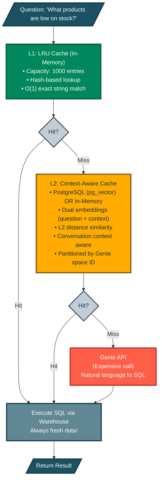
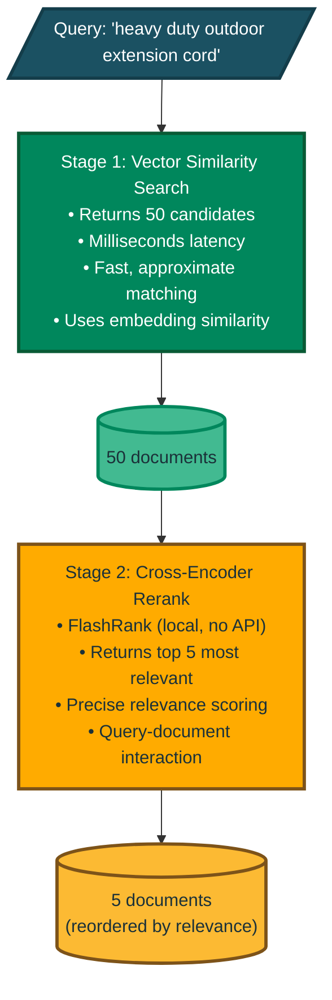
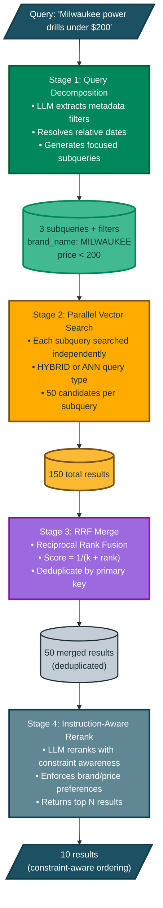

# Key Capabilities

These are the powerful features that make DAO production-ready. Don't worry if some seem complex — you can start simple and add these capabilities as you need them.

## 1. Dual Deployment Targets

**What is this?** DAO agents can be deployed to either **Databricks Model Serving** or **Databricks Apps** using the same configuration, giving you flexibility in how you expose your agent.

**Why this matters:**
- **Model Serving**: Traditional endpoint for inference workloads, autoscaling, pay-per-token pricing
- **Databricks Apps**: Full web applications with custom UI, background jobs, and richer integrations
- **Single Configuration**: Switch deployment targets with one line change — no code rewrite needed
- **Environment Consistency**: Same YAML config works in both environments

**Comparison:**

| Feature | Model Serving | Databricks Apps |
|---------|--------------|-----------------|
| **Use Case** | Inference API endpoint | Full web application |
| **Scaling** | Auto-scales based on load | Manual scaling configuration |
| **UI** | API only | Custom web UI possible |
| **Pricing** | Pay per token/request | Compute-based |
| **Deployment Speed** | ~2-5 minutes | ~2-5 minutes |
| **Best For** | API integrations, high throughput | Interactive apps, custom UX |

**How to configure:**

```yaml
app:
  name: my_agent
  deployment_target: model_serving  # or 'apps'
  
  # Model Serving specific options (only used when deployment_target: model_serving)
  endpoint_name: my_agent_endpoint
  workload_size: Small
  scale_to_zero: true
  
  agents:
    - *my_agent
```

**Deploy to Model Serving:**
```bash
dao-ai deploy -c config.yaml --target model_serving
```

**Deploy to Databricks Apps:**
```bash
dao-ai deploy -c config.yaml --target apps
```

**CLI override:** The `--target` flag always takes precedence over the YAML config, making it easy to deploy the same config to different environments.

**Behind the scenes:**
- Model Serving deployments create an MLflow model and serving endpoint
- Apps deployments create a Databricks App with MLflow experiment tracking
- Both share the same agent code, tools, and orchestration logic
- Environment variables and secrets are automatically configured for each platform

## 2. Multi-Tool Support

**What are tools?** Tools are actions an agent can perform — like querying a database, calling an API, or running custom code.

DAO supports four types of tools, each suited for different use cases:

| Tool Type | Use Case | Example |
|-----------|----------|---------|
| **Python** | Custom business logic | `dao_ai.tools.current_time_tool` |
| **Factory** | Complex initialization with config | `create_vector_search_tool(retriever=...)`, `create_genie_tool(genie_room=...)` |
| **Inline** | Quick prototyping, simple tools defined in YAML | Define tool code directly in config |
| **Agent Endpoint** | Call external agents as tools | `create_agent_endpoint_tool(llm=...)` for Agent Bricks, Kasal |
| **Unity Catalog** | Governed SQL functions | `catalog.schema.find_product_by_sku` |
| **MCP** | External services via Model Context Protocol | GitHub, Slack, custom APIs |

```yaml
tools:
  # Python function - direct import
  time_tool:
    function:
      type: python
      name: dao_ai.tools.current_time_tool

  # Factory - initialized with config
  search_tool:
    function:
      type: factory
      name: dao_ai.tools.create_vector_search_tool
      args:
        retriever: *products_retriever

  # Inline - define tool code directly in YAML (great for prototyping)
  calculator:
    function:
      type: inline
      code: |
        from langchain.tools import tool

        @tool
        def calculator(expression: str) -> str:
            """Evaluate a mathematical expression."""
            return str(eval(expression))

  # Agent Endpoint - call external agents
  specialist_agent:
    function:
      type: factory
      name: dao_ai.tools.create_agent_endpoint_tool
      args:
        llm: *external_agent_endpoint
        name: specialist
        description: "Delegate to external specialist agent"

  # Unity Catalog - governed SQL function
  sku_lookup:
    function:
      type: unity_catalog
      name: find_product_by_sku
      schema: *retail_schema

  # MCP - external service integration
  github_mcp:
    function:
      type: mcp
      transport: streamable_http
      connection: *github_connection
```

## 3. On-Behalf-Of User Support

**What is this?** Many Databricks resources (like SQL warehouses, Genie spaces, and LLMs) can operate "on behalf of" the end user, using their permissions instead of the agent's service account credentials.

**Why this matters:**
- **Security**: Users can only access data they're authorized to see
- **Compliance**: Audit logs show the actual user who made the request, not a service account
- **Governance**: Unity Catalog permissions are enforced at the user level
- **Flexibility**: No need to grant broad permissions to a service account

**How it works:** When `on_behalf_of_user: true` is set, the resource inherits the calling user's identity and permissions from the API request.

**Supported resources:**
```yaml
resources:
  # LLMs - use caller's permissions for model access
  llms:
    claude: &claude
      name: databricks-claude-3-7-sonnet
      on_behalf_of_user: true      # Inherits caller's model access
  
  # Warehouses - execute SQL as the calling user
  # Provide warehouse_id directly, or just name to resolve the ID automatically
  warehouses:
    analytics: &analytics_warehouse
      warehouse_id: abc123def456   # or omit and use name instead
      on_behalf_of_user: true      # Queries run with user's data permissions
  
  # Genie - natural language queries with user's context
  # Provide space_id directly, or just name to resolve the ID automatically
  genie_rooms:
    sales_genie: &sales_genie
      space_id: xyz789             # or omit and use name instead
      on_behalf_of_user: true      # Genie uses caller's data access
```

**Real-world example:**  
Your agent helps employees query HR data. With `on_behalf_of_user: true`:
- Managers can see their team's salary data
- Individual contributors can only see their own data
- HR admins can see all data

The same agent code enforces different permissions for each user automatically.

**Important notes:**
- The calling application must pass the user's identity in the API request
- The user must have the necessary permissions on the underlying resources
- Not all Databricks resources support on-behalf-of functionality

## 4. Advanced Caching (Genie Queries)

**Why caching matters:** When users ask similar questions repeatedly, you don't want to pay for the same AI processing over and over. Caching stores results so you can reuse them.

**What makes DAO's caching special:** Instead of just storing old answers (which become stale), DAO stores the **SQL query** that Genie generated. When a similar question comes in, DAO re-runs the SQL to get **fresh data** without calling the expensive Genie API again.

**💰 Cost savings:** If users frequently ask "What's our inventory?", the first query costs $X (Genie API call). Subsequent similar queries cost only pennies (just running SQL).

DAO provides **two-tier caching** for Genie natural language queries, dramatically reducing costs and latency:

```yaml
genie_tool:
  function:
    type: factory
    name: dao_ai.tools.create_genie_tool
    args:
      genie_room: *retail_genie_room
      
      # L1: Fast O(1) exact match lookup
      lru_cache_parameters:
        warehouse: *warehouse
        capacity: 1000                   # Max cached queries (default: 1000)
        time_to_live_seconds: 86400      # 1 day (default), use -1 or None for never expire

      # L2: Context-aware similarity search via pg_vector (cosine similarity)
      context_aware_cache_parameters:
        database: *postgres_db
        warehouse: *warehouse
        embedding_model: *embedding_model  # Default: databricks-gte-large-en
        similarity_threshold: 0.85         # 0.0-1.0 (default: 0.85), higher = stricter
        time_to_live_seconds: 86400        # 1 day (default), use -1 or None for never expire
        table_name: genie_context_aware_cache   # Optional, default: genie_context_aware_cache
        # IVFFlat index tuning (auto-computed by default, scales to 1M+ rows)
        # ivfflat_lists: null              # Auto: max(100, sqrt(row_count))
        # ivfflat_probes: null             # Auto: max(10, sqrt(lists))
        # ivfflat_candidates: 20           # Top-K for Python reranking
```

### Cache Architecture



### LRU Cache (L1)

The **LRU (Least Recently Used) Cache** provides instant lookups for exact question matches:

| Parameter | Default | Description |
|-----------|---------|-------------|
| `capacity` | 1000 | Maximum number of cached queries |
| `time_to_live_seconds` | 86400 | Cache entry lifetime (-1 = never expire) |
| `warehouse` | Required | Databricks warehouse for SQL execution |

**Best for:** Repeated exact queries, chatbot interactions, dashboard refreshes

### Context-Aware Cache (L2)

The **Context-Aware Cache** finds similar questions even when worded differently using vector embeddings and similarity search. It includes **conversation context awareness** to improve matching in multi-turn conversations. DAO provides two implementations:

#### PostgreSQL-Based Context-Aware Cache

Uses PostgreSQL with pg_vector for persistent, multi-instance shared caching. Similarity search uses **cosine similarity** with a two-phase approach: an IVFFlat index-optimized scan retrieves top-K candidates by question distance, then Python-side reranking applies combined similarity, threshold checks, and bidirectional context-skip logic.

| Parameter | Default | Description |
|-----------|---------|-------------|
| `similarity_threshold` | 0.85 | Minimum cosine similarity for cache hit (0.0-1.0) |
| `time_to_live_seconds` | 86400 | Cache entry lifetime (-1 = never expire) |
| `embedding_model` | `databricks-gte-large-en` | Model for generating question embeddings |
| `database` | Required | PostgreSQL with pg_vector extension |
| `warehouse` | Required | Databricks warehouse for SQL execution |
| `table_name` | `genie_context_aware_cache` | Table name for cache storage |
| `context_window_size` | 4 | Number of previous conversation turns to include |
| `context_similarity_threshold` | 0.80 | Minimum similarity for conversation context (skipped when either side has no context) |
| `question_weight` | 0.6 | Weight for question similarity in combined score (0.0-1.0) |
| `context_weight` | 0.4 | Weight for context similarity (computed as 1 - question_weight if not set) |
| `embedding_dims` | Auto-detected | Embedding vector dimensions (auto-detected from model if not specified) |
| `max_context_tokens` | 2000 | Maximum token length for conversation context embeddings |
| `ivfflat_lists` | `null` (auto) | IVF index lists. Auto-computed as `max(100, sqrt(row_count))` at index creation |
| `ivfflat_probes` | `null` (auto) | Lists probed per query. Auto-computed as `max(10, sqrt(lists))` |
| `ivfflat_candidates` | 20 | Top-K candidates retrieved before Python-side reranking |

**Scaling**: With auto-computed defaults, the cache scales to **1 million+ rows** without manual tuning. The IVFFlat index parameters adapt to table size automatically.

**Best for:** Production deployments with multiple instances, large cache sizes (thousands+), and cross-instance cache sharing

#### In-Memory Context-Aware Cache

Uses in-memory storage without external database dependencies:

```yaml
genie_tool:
  function:
    type: factory
    name: dao_ai.tools.create_genie_tool
    args:
      genie_room: *retail_genie_room
      
      # In-memory context-aware cache (no database required)
      in_memory_context_aware_cache_parameters:
        warehouse: *warehouse
        embedding_model: *embedding_model  # Default: databricks-gte-large-en
        similarity_threshold: 0.85         # 0.0-1.0 (default: 0.85)
        time_to_live_seconds: 86400        # 1 day (default), use -1 or None for never expire
        capacity: 1000                     # Max cache entries (LRU eviction when full)
        context_window_size: 4             # Number of previous conversation turns (default)
        context_similarity_threshold: 0.80 # Minimum context similarity (bidirectional skip)
        question_weight: 0.6               # Weight for question similarity
        context_weight: 0.4                # Weight for context similarity
        embedding_dims: null               # Auto-detected from model
        max_context_tokens: 2000           # Max context token length
```

| Parameter | Default | Description |
|-----------|---------|-------------|
| `similarity_threshold` | 0.85 | Minimum cosine similarity for cache hit (0.0-1.0) |
| `time_to_live_seconds` | 86400 | Cache entry lifetime (-1 = never expire) |
| `embedding_model` | `databricks-gte-large-en` | Model for generating question embeddings |
| `warehouse` | Required | Databricks warehouse for SQL execution |
| `capacity` | 1000 | Maximum cache entries (LRU eviction when full) |
| `context_window_size` | 4 | Number of previous conversation turns to include |
| `context_similarity_threshold` | 0.80 | Minimum similarity for conversation context (skipped when either side has no context) |
| `question_weight` | 0.6 | Weight for question similarity in combined score (0.0-1.0) |
| `context_weight` | 0.4 | Weight for context similarity (computed as 1 - question_weight if not set) |
| `embedding_dims` | Auto-detected | Embedding vector dimensions (auto-detected from model if not specified) |
| `max_context_tokens` | 2000 | Maximum token length for conversation context embeddings |

**Best for:** Single-instance deployments, development/testing, scenarios without database access, moderate cache sizes (hundreds to low thousands)

**Key Differences:**
- ✅ **No external database required** - Simpler setup and deployment
- ✅ **Same cosine similarity algorithm** - Consistent behavior with PostgreSQL version
- ⚠️ **Per-instance cache** - Each replica has its own cache (not shared)
- ⚠️ **No persistence** - Cache is lost on restart
- ⚠️ **Memory-bound** - Limited by available RAM; use capacity limits

**Best for:** Catching rephrased questions like:
- "What's our inventory status?" ≈ "Show me stock levels"
- "Top selling products this month" ≈ "Best sellers in December"

**Conversation Context Awareness:**  
The context-aware cache tracks conversation history to resolve ambiguous references:
- **User:** "Show me products with low stock"
- **User:** "What about *them* in the warehouse?" ← Uses context to understand "them" = low stock products

This works by embedding both the current question *and* recent conversation turns, then computing a weighted similarity score. This dramatically improves cache hits in multi-turn conversations where users naturally use pronouns and references.

**Weight Configuration:**  
The `question_weight` and `context_weight` parameters control how question vs conversation context similarity are combined into the final score:
- Both weights must sum to 1.0 (if only one is provided, the other is computed automatically)
- Higher `question_weight` prioritizes matching the exact question wording
- Higher `context_weight` prioritizes matching the conversation context, useful for multi-turn conversations with pronouns and references

### Cache Behavior

1. **SQL Caching, Not Results**: The cache stores the *generated SQL query*, not the query results. On a cache hit, the SQL is re-executed against your warehouse, ensuring **data freshness**.

2. **Conversation-Aware Matching**: The context-aware cache uses a rolling window of recent conversation turns (default: 4) to provide context for similarity matching. This helps resolve pronouns and references like "them", "that", or "the same products" by considering what was discussed previously. A **bidirectional context-skip** rule automatically bypasses the context threshold when either the cached entry or the current query has no conversation context, preventing false misses for first messages or context-free queries.

3. **Refresh on Hit**: When a context-aware cache entry is found but expired:
   - The expired entry is deleted
   - A cache miss is returned
   - Genie generates fresh SQL
   - The new SQL is cached

4. **Multi-Instance Aware**: Each LRU cache is per-instance (in Model Serving, each replica has its own). The PostgreSQL context-aware cache is shared across all instances. The in-memory context-aware cache is per-instance (not shared).

5. **Space ID Partitioning**: Cache entries are isolated per Genie space, preventing cross-space cache pollution.

## 5. Vector Search Reranking & Instructed Retrieval

**The problem:** Vector search (semantic similarity) is fast but sometimes returns loosely related results. It's like a librarian who quickly grabs 50 books that *might* be relevant.

**The solution:** Reranking is like having an expert review those 50 books and pick the best 5 that *actually* answer your question.

**Benefits:**
- ✅ More accurate search results
- ✅ Better user experience (relevant answers)
- ✅ No external API calls (runs locally with FlashRank)

DAO supports **two-stage retrieval** with FlashRank reranking to improve search relevance without external API calls:

```yaml
retrievers:
  products_retriever: &products_retriever
    vector_store: *products_vector_store
    columns: [product_id, name, description, price]
    search_parameters:
      num_results: 50        # Retrieve more candidates
      query_type: ANN
    rerank:
      model: ms-marco-MiniLM-L-12-v2   # Local cross-encoder model
      top_n: 5                          # Return top 5 after reranking
```

### How It Works



### Why Reranking?

| Approach | Pros | Cons |
|----------|------|------|
| **Vector Search Only** | Fast, scalable | Embedding similarity ≠ relevance |
| **Reranking** | More accurate relevance | Slightly higher latency |
| **Both (Two-Stage)** | Best of both worlds | Optimal quality/speed tradeoff |

Vector embeddings capture semantic similarity but may rank loosely related documents highly. Cross-encoder reranking evaluates query-document pairs directly, dramatically improving result quality for the final user.

### Available Models

See [FlashRank](https://github.com/PrithivirajDamodaran/FlashRank) for the full list of supported models.

| Model | Size | Speed | Use Case |
|-------|------|-------|----------|
| `ms-marco-TinyBERT-L-2-v2` | ~4MB | ⚡⚡⚡ Fastest | High-throughput, latency-sensitive |
| `ms-marco-MiniLM-L-12-v2` | ~34MB | ⚡⚡ Fast | Default, best cross-encoder |
| `rank-T5-flan` | ~110MB | ⚡ Moderate | Best non cross-encoder |
| `ms-marco-MultiBERT-L-12` | ~150MB | Slower | Multilingual (100+ languages) |
| `ce-esci-MiniLM-L12-v2` | - | ⚡⚡ Fast | E-commerce optimized |
| `miniReranker_arabic_v1` | - | ⚡⚡ Fast | Arabic language |

### Configuration Options

```yaml
rerank:
  model: ms-marco-MiniLM-L-12-v2    # FlashRank model name
  top_n: 10                          # Documents to return (default: all)
  cache_dir: ~/.dao_ai/cache/flashrank  # Model weights cache location
  columns: [description, name]       # Columns for Databricks Reranker (optional)
```

**Note:** Model weights are downloaded automatically on first use (~34MB for MiniLM-L-12-v2).

### Instructed Retrieval

**The problem:** Standard vector search ignores metadata constraints entirely. When a user asks "Milwaukee power drills under $200 from last month", vector search only matches on semantic similarity — it can't enforce brand, price, or recency constraints. Queries with multiple intents or exclusions ("cordless tools excluding DeWalt") fare even worse.

**The solution:** Instructed Retrieval extends basic RAG by automatically translating natural language constraints into executable metadata filters. An LLM decomposes complex queries into focused subqueries with filters, executes them in parallel, and merges results using Reciprocal Rank Fusion (RRF).

**Benefits:**
- Automatic filter extraction from natural language ("under $200" becomes `price < 200`)
- Multi-intent queries split into parallel subqueries for broader recall
- RRF merging produces a unified, deduplicated ranking
- Optional instruction-aware reranking, query routing, and result verification

### How Instructed Retrieval Works



### Instructed Retrieval Configuration

```yaml
retrievers:
  instructed_retriever: &instructed_retriever
    vector_store: *products_vector_store
    search_parameters:
      num_results: 50
      query_type: HYBRID
    instructed:
      # Column metadata — single source of truth for all pipeline components
      columns:
        - name: brand_name
          type: string
          description: "Brand/manufacturer (MILWAUKEE, DEWALT, MAKITA, etc.)"
        - name: merchandise_class
          type: string
          description: "Product category (POWER TOOLS, HAND TOOLS, PAINT, etc.)"
        - name: price
          type: number
          description: "Price in USD"
          operators: ["", "<", "<=", ">", ">="]
        - name: updated_at
          type: datetime
          description: "Last update timestamp"
          operators: ["", ">", ">=", "<", "<="]
      constraints:
        - "Use merchandise_class for category filtering"
        - "Use brand_name for brand filtering"
      decomposition:
        model: *fast_llm          # Smaller model for low latency
        max_subqueries: 3
        rrf_k: 60
        normalize_filter_case: uppercase
        examples:
          - query: "cheap Milwaukee drills"
            filters: {"price <": 100, "brand_name": "MILWAUKEE"}
          - query: "cordless power tools excluding DeWalt"
            filters: {"product_name LIKE": "cordless", "brand_name NOT": "DEWALT"}
      # Instruction-aware LLM reranking (uses schema context above)
      rerank:
        model: *fast_llm
        instructions: |
          Prioritize results based on user constraints:
          - Brand preferences: boost specified brands, demote excluded brands
          - Category: prefer exact merchandise_class matches
        top_n: 10
```

### Key Configuration Fields

| Field | Default | Description |
|-------|---------|-------------|
| `columns` | Required | Column metadata (name, type, description, operators) used by all pipeline components |
| `constraints` | `null` | Default constraints to always apply (e.g., "Prefer recent products") |
| `decomposition.model` | `null` | LLM for query decomposition — use a fast model (Haiku, GPT-3.5) for low latency |
| `decomposition.max_subqueries` | 3 | Maximum number of parallel subqueries |
| `decomposition.rrf_k` | 60 | RRF constant — lower values weight top ranks more heavily |
| `decomposition.examples` | `null` | Few-shot examples teaching your metadata "dialect" for filter translation |
| `decomposition.normalize_filter_case` | `null` | Auto-normalize filter string values to `uppercase` or `lowercase` |

### Optional Pipeline Components

Beyond core query decomposition and RRF merging, instructed retrieval supports three additional pipeline stages:

**Instruction-Aware Reranking** (`instructed.rerank`): An LLM-based reranking stage that uses schema context and custom instructions to reorder results. Unlike FlashRank (which is model-based and local), this stage understands your domain constraints and can enforce brand preferences, category matching, and other business rules.

```yaml
instructed:
  rerank:
    model: *fast_llm
    instructions: "Prioritize by brand preferences and category match"
    top_n: 10
```

**Query Router** (`instructed.router`): Automatically routes simple queries (e.g., "drill bits") through a fast standard search path and complex queries (e.g., "Milwaukee drills excluding DeWalt") through the full instructed pipeline. When `auto_bypass: true` (default), simple queries skip the instruction reranker and verifier entirely.

```yaml
instructed:
  router:
    model: *fast_llm
    default_mode: standard      # Fallback if routing fails
    auto_bypass: true           # Skip expensive stages for simple queries
```

**Result Verifier** (`instructed.verifier`): Validates that returned results satisfy the user's constraints. Returns structured feedback (unmet constraints, suggested filter adjustments) for intelligent retry when results don't match intent.

```yaml
instructed:
  verifier:
    model: *fast_llm
    on_failure: warn_and_retry  # Options: warn, retry, warn_and_retry
    max_retries: 1
```

### Latency Comparison

| Configuration | Latency | Use Case |
|--------------|---------|----------|
| Standard (no decomposition) | ~100ms | Simple keyword queries |
| Instructed (decomposition + RRF) | ~200-300ms | Queries with metadata constraints |
| Full Pipeline (all stages) | ~800-1200ms | Complex queries with routing and verification |

**Fallback behavior:** If decomposition fails (LLM error, parsing error), the system automatically falls back to standard single-query search, ensuring robustness in production.

**Example configurations:** See [`config/examples/16_instructed_retriever/`](../config/examples/16_instructed_retriever/) for complete working examples including basic instructed retrieval and the full pipeline with router and verifier.

## 6. Human-in-the-Loop Approvals

**Why this matters:** Some actions are too important to automate completely. For example, you might want human approval before an agent:
- Deletes data
- Sends external communications
- Places large orders
- Modifies production systems

**How it works:** Add a simple configuration to any tool, and the agent will pause and ask for human approval before executing it.

Add approval gates to sensitive tool calls without changing tool code:

```yaml
tools:
  dangerous_operation:
    function:
      type: python
      name: my_package.dangerous_function
      human_in_the_loop:
        review_prompt: "This operation will modify production data. Approve?"
```

## 7. Memory & State Persistence

**What is memory?** Your agent needs to remember past conversations. When a user asks "What about size XL?" the agent should remember they were talking about shirts.

**Memory backend options:**
1. **In-Memory**: Fast but temporary (resets when agent restarts). Good for testing and development.
2. **PostgreSQL**: Persistent relational storage (survives restarts). Good for production systems requiring conversation history and user preferences.
3. **Lakebase**: Databricks-managed PostgreSQL instance with Unity Catalog integration. Good for production deployments that want to stay within the Databricks ecosystem.

**Why Lakebase?**
- **Native Databricks integration** - No external database required
- **Managed PostgreSQL** - ACID transactions, full relational database capabilities
- **Unified governance** - Same Unity Catalog permissions as your data
- **Cost-effective** - Uses existing Databricks infrastructure

Configure conversation memory with in-memory, PostgreSQL, or Lakebase backends:

```yaml
memory:
  # Option 1: PostgreSQL (external database)
  checkpointer:
    name: conversation_checkpointer
    type: postgres
    database: *postgres_db
  
  store:
    name: user_preferences_store
    type: postgres
    database: *postgres_db
    embedding_model: *embedding_model

# Option 2: Lakebase (Databricks-native)
memory:
  checkpointer:
    name: conversation_checkpointer
    type: lakebase
    schema: *my_schema              # Unity Catalog schema
    table_name: agent_checkpoints   # PostgreSQL table for conversation state
  
  store:
    name: user_preferences_store
    type: lakebase
    schema: *my_schema
    table_name: agent_store         # PostgreSQL table for key-value storage
    embedding_model: *embedding_model
```

**Choosing a backend:**
- **In-Memory**: Development and testing only
- **PostgreSQL**: When you need external database features or already have PostgreSQL infrastructure
- **Lakebase**: When you want Databricks-native persistence with Unity Catalog governance

### Long-Term Memory

Beyond conversation history, DAO supports **long-term memory** that persists user profiles, preferences, and interaction patterns across sessions. This enables personalized responses without the user repeating themselves.

Long-term memory has three components:

1. **Structured Schemas** -- Define what to remember using typed schemas:
   - `user_profile` -- A consolidated profile (name, role, expertise, communication style, goals) that merges new information over time
   - `preference` -- Individual preference records (category, preference, context) searchable independently
   - `episode` -- Records of notable interactions (situation, approach, outcome, lesson) for experience-based learning

2. **Background Extraction** -- Automatically extracts memories from conversations in a background thread after each turn, adding zero latency to responses. Uses langmem's `ReflectionExecutor` with debouncing.

3. **Automatic Memory Injection** -- Before each model call, relevant memories are automatically searched and injected into the system prompt via `MemoryContextMiddleware`. The agent receives personalized context without needing to call `search_memory` explicitly.

Configure long-term memory with the `extraction` block:

```yaml
memory:
  checkpointer:
    name: conversation_checkpointer
    type: lakebase
    schema: *my_schema
    table_name: agent_checkpoints

  store:
    name: memory_store
    type: lakebase
    schema: *my_schema
    table_name: agent_store
    embedding_model: *embedding_model

  extraction:
    schemas:
      - user_profile
      - preference
      - episode
    instructions: |
      Extract the user's name, role, preferences, and any notable
      interaction patterns. Update the user profile with new information.
    auto_inject: true           # Inject relevant memories into prompts
    auto_inject_limit: 5        # Max memories to inject per turn
    background_extraction: true # Extract memories in background thread
    extraction_model: *small_llm   # Optional: cheaper model for extraction
    query_model: *small_llm        # Optional: cheaper model for search queries
```

**Memory tools available to agents:**

| Tool | Description |
|------|-------------|
| `manage_memory` | Agent-driven CRUD on memory items (create, update, delete) |
| `search_memory` | Semantic search over stored memories |
| `search_user_profile` | Direct lookup of the user's consolidated profile |

The `manage_memory` and `search_memory` tools are automatically added when a `store` is configured. The `search_user_profile` tool is added when the `user_profile` schema is included in the extraction config.

## 8. MLflow Prompt Registry Integration

**The problem:** Prompts (instructions you give to AI models) need constant refinement. Hardcoding them in YAML means every change requires redeployment.

**The solution:** Store prompts in MLflow's Prompt Registry. Now prompt engineers can:
- Update prompts without touching code
- Version prompts (v1, v2, v3...)
- A/B test different prompts
- Roll back to previous versions if needed

**Real-world example:**  
Your marketing team wants to make the agent's tone more friendly. With the prompt registry, they update it in MLflow, and the agent uses the new prompt immediately — no code deployment required.

Store and version prompts externally, enabling prompt engineers to iterate without code changes:

```yaml
prompts:
  product_expert_prompt:
    schema: *retail_schema
    name: product_expert_prompt
    alias: production  # or version: 3
    default_template: |
      You are a product expert...
    tags:
      team: retail
      environment: production

agents:
  product_expert:
    prompt: *product_expert_prompt  # Loaded from MLflow registry
```

## 9. Automated Prompt Optimization

**What is this?** Instead of manually tweaking prompts through trial and error, DAO can automatically test variations and find the best one.

**How it works:** Using GEPA (Generative Evolution of Prompts and Agents):
1. You provide a training dataset with example questions
2. DAO generates multiple prompt variations
3. Each variation is tested against your examples
4. The best-performing prompt is selected

**Think of it like:** A/B testing for AI prompts, but automated.

Use GEPA (Generative Evolution of Prompts and Agents) to automatically improve prompts:

```yaml
optimizations:
  prompt_optimizations:
    optimize_diy_prompt:
      prompt: *diy_prompt
      agent: *diy_agent
      dataset: *training_dataset
      reflection_model: "openai:/gpt-4"
      num_candidates: 5
```

## 10. Guardrails & Response Quality Middleware

**What are guardrails?** Safety and quality controls that validate agent responses before they reach users. Think of them as quality assurance checkpoints.

**Why this matters:** AI models can sometimes generate responses that are:
- Inappropriate or unsafe
- Too long or too short
- Missing required information (like citations)
- In the wrong format or tone
- Off-topic or irrelevant
- Containing sensitive keywords that should be blocked
- Not grounded in the retrieved data (hallucinations)

DAO provides two complementary middleware systems for response quality control:

---

### A. Guardrail Middleware (Content Safety & Quality)

**GuardrailMiddleware** uses MLflow judges (`mlflow.genai.judges.make_judge`) to evaluate responses against custom criteria, with automatic retry and improvement loops. The **prompt determines the evaluation type** -- tone, completeness, veracity/groundedness, or any custom criteria.

Tool context from `ToolMessage` objects in the conversation (search results, SQL results, Genie responses) is automatically extracted and included in the `inputs` dict. This enables veracity/groundedness prompts that check whether the response is faithful to the retrieved data.

**Use cases:**
- Professional tone validation
- Completeness checks (did the agent fully answer the question?)
- Veracity/groundedness (is the response faithful to retrieved data?)
- Brand voice consistency
- Custom business rules

**How it works:**
1. Agent generates a response
2. Tool context is extracted from the conversation history
3. MLflow judge evaluates against your criteria (prompt-based)
4. If fails: Provides feedback and asks agent to try again
5. If passes: Response goes to user
6. After max retries: Falls back with a quality warning
7. If judge call fails: Configurable fail-open (default) or fail-closed

```yaml
agents:
  customer_service_agent:
    model: *default_llm
    guardrails:
      # Professional tone check
      - name: professional_tone
        model: *judge_llm
        prompt: *professional_tone_prompt  # From MLflow Prompt Registry
        num_retries: 3
      
      # Completeness validation
      - name: completeness_check
        model: *judge_llm
        prompt: |
          Does the response in {{ outputs }} fully address the question in {{ inputs }}?
          Rate as true if yes, false if no.
        num_retries: 2
      
      # Veracity/groundedness check
      # Tool context is automatically available in {{ inputs }}
      - name: veracity_check
        model: *judge_llm
        prompt: |
          Is the response in {{ outputs }} grounded in the retrieved context in {{ inputs }}?
          Rate as true if grounded, false if it fabricates information.
        num_retries: 2
        fail_on_error: false
```

**Prompt template format:** Guardrail prompts use Jinja2 template variables:
- `{{ inputs }}` -- Contains the user query AND extracted tool context (search results, SQL results, etc.)
- `{{ outputs }}` -- Contains the agent's response

**Specialized guardrails (zero-config, no prompt needed):**

These guardrails have built-in expert prompts and sensible defaults. Configure via the `middleware:` section:

```yaml
middleware:
  # Veracity - grounded in tool/retrieval context (auto-skips when no tools used)
  veracity_check:
    name: dao_ai.middleware.create_veracity_guardrail_middleware
    args:
      model: "databricks:/databricks-claude-3-7-sonnet"

  # Relevance - ensures response addresses the actual query
  relevance_check:
    name: dao_ai.middleware.create_relevance_guardrail_middleware
    args:
      model: "databricks:/databricks-claude-3-7-sonnet"

  # Tone - validates against preset profiles (professional, casual, technical, empathetic, concise)
  tone_check:
    name: dao_ai.middleware.create_tone_guardrail_middleware
    args:
      model: "databricks:/databricks-claude-3-7-sonnet"
      tone: professional

  # Conciseness - hybrid length check + LLM verbosity evaluation
  conciseness_check:
    name: dao_ai.middleware.create_conciseness_guardrail_middleware
    args:
      model: "databricks:/databricks-claude-3-7-sonnet"
      max_length: 2000
      check_verbosity: true
```

**Scorer-based guardrails (MLflow Scorers):**

Any `mlflow.genai.scorers.base.Scorer` can be used as a guardrail, including built-in `GuardrailsScorer` validators for toxicity, PII, jailbreak detection, and more.

```yaml
guardrails:
  # MLflow Scorer -- detects PII in responses
  pii_check: &pii_check
    name: pii_detection
    scorer: mlflow.genai.scorers.guardrails.DetectPII
    scorer_args:
      pii_entities: ["CREDIT_CARD", "SSN"]
    fail_on_error: true

  # MLflow Scorer -- detects toxic language
  toxic_check: &toxic_check
    name: toxic_language
    scorer: mlflow.genai.scorers.guardrails.ToxicLanguage
    scorer_args:
      threshold: 0.7

agents:
  my_agent:
    guardrails:
      - *pii_check
      - *toxic_check
```

Available built-in scorers: `ToxicLanguage`, `NSFWText`, `DetectJailbreak`, `DetectPII`, `SecretsPresent`, `GibberishText`.

Scorer-based guardrails can also be configured via the middleware factory pattern:

```yaml
middleware:
  secrets_check:
    name: dao_ai.middleware.create_scorer_guardrail_middleware
    args:
      name: secrets_check
      scorer_name: mlflow.genai.scorers.guardrails.SecretsPresent
```

**Additional guardrail types:**

```yaml
# Content Filter - Deterministic keyword blocking (no LLM needed)
# Uses compiled regex for efficient matching
middleware:
  content_filter:
    name: dao_ai.middleware.create_content_filter_middleware
    args:
      banned_keywords: [password, credit_card, ssn]
      block_message: "I cannot provide that information."

  # Safety Guardrail - MLflow judge-based safety evaluation
  # Uses structured output (safe/unsafe) for reliable classification
  safety_check:
    name: dao_ai.middleware.create_safety_guardrail_middleware
    args:
      safety_model: "databricks:/databricks-claude-3-7-sonnet"
```

**Real-world example:**  
Your customer service agent must maintain a professional tone and never discuss competitor products:

```yaml
agents:
  support_agent:
    guardrails:
      - name: professional_tone
        model: *judge_llm
        prompt: *professional_tone_prompt
        num_retries: 3
      
      - name: no_competitors
        type: content_filter
        blocked_keywords: [competitor_a, competitor_b, competitor_c]
        on_failure: fallback
        fallback_message: "I can only discuss our own products and services."
```

---

### B. DSPy-Style Assertion Middleware (Programmatic Validation)

**Assertion middleware** provides programmatic, code-based validation inspired by DSPy's assertion mechanisms. Best for deterministic checks and custom logic.

| Middleware | Behavior | Use Case |
|------------|----------|----------|
| **AssertMiddleware** | Hard constraint - retries until satisfied or fails | Required output formats, mandatory citations, length constraints |
| **SuggestMiddleware** | Soft constraint - logs feedback, optional single retry | Style preferences, quality suggestions, optional improvements |
| **RefineMiddleware** | Iterative improvement - generates N attempts, selects best | Optimizing response quality, A/B testing variations |

```yaml
# Configure via middleware in agents
agents:
  research_agent:
    middleware:
      # Hard constraint: Must include citations
      - type: assert
        constraint: has_citations
        max_retries: 3
        on_failure: fallback
        fallback_message: "Unable to provide cited response."
      
      # Soft suggestion: Prefer concise responses
      - type: suggest
        constraint: length_under_500
        allow_one_retry: true
```

**Programmatic usage:**

```python
from dao_ai.middleware.assertions import (
    create_assert_middleware,
    create_suggest_middleware,
    create_refine_middleware,
    LengthConstraint,
    KeywordConstraint,
)

# Hard constraint: response must be between 100-500 chars
assert_middleware = create_assert_middleware(
    constraint=LengthConstraint(min_length=100, max_length=500),
    max_retries=3,
    on_failure="fallback",
)

# Soft constraint: suggest professional tone
suggest_middlewares = create_suggest_middleware(
    constraint=lambda response, ctx: "professional" in response.lower(),
    allow_one_retry=True,
)

# Iterative refinement: generate 3 attempts, pick best
def quality_score(response: str, ctx: dict) -> float:
    # Score based on length, keywords, structure
    score = 0.0
    if 100 <= len(response) <= 500:
        score += 0.5
    if "please" in response.lower() or "thank you" in response.lower():
        score += 0.3
    if response.endswith(".") or response.endswith("!"):
        score += 0.2
    return score

refine_middlewares = create_refine_middleware(
    reward_fn=quality_score,
    threshold=0.8,
    max_iterations=3,
)

# Combine all middlewares into a single list
all_middlewares = assert_middlewares + suggest_middlewares + refine_middlewares
```

---

### When to Use Which?

| Use Case | Recommended Middleware |
|----------|------------------------|
| **Tone/style validation** | GuardrailMiddleware (LLM judge) |
| **Safety checks** | SafetyGuardrailMiddleware |
| **Keyword blocking** | ContentFilterMiddleware |
| **Length constraints** | AssertMiddleware (deterministic) |
| **Citation requirements** | AssertMiddleware or GuardrailMiddleware |
| **Custom business logic** | AssertMiddleware (programmable) |
| **Quality optimization** | RefineMiddleware (generates multiple attempts) |
| **Soft suggestions** | SuggestMiddleware |

**Best practice:** Combine both approaches:
- **ContentFilter** for fast, deterministic blocking
- **AssertMiddleware** for programmatic constraints
- **GuardrailMiddleware** for nuanced, LLM-based evaluation

```yaml
agents:
  production_agent:
    middleware:
      # Layer 1: Fast keyword blocking
      - type: content_filter
        blocked_keywords: [password, ssn]
      
      # Layer 2: Deterministic length check
      - type: assert
        constraint: length_range
        min_length: 50
        max_length: 1000
      
      # Layer 3: LLM-based quality evaluation
      - type: guardrail
        name: professional_tone
        model: *judge_llm
        prompt: *professional_tone_prompt
```

## 11. Conversation Summarization

**The problem:** AI models have a maximum amount of text they can process (the "context window"). Long conversations eventually exceed this limit.

**The solution:** When conversations get too long, DAO automatically:
1. Summarizes the older parts of the conversation
2. Keeps recent messages as-is (for accuracy)
3. Continues the conversation with the condensed history

**Example:**  
After 20 messages about product recommendations, the agent summarizes: *"User is looking for power tools, prefers cordless, budget around $200."* This summary replaces the old messages, freeing up space for the conversation to continue.

Automatically summarize long conversation histories to stay within context limits:

```yaml
chat_history:
  max_tokens: 4096                    # Max tokens for summarized history
  max_tokens_before_summary: 8000     # Trigger summarization at this threshold
  max_messages_before_summary: 20     # Or trigger at this message count
```

The `LoggingSummarizationMiddleware` provides detailed observability:

```
INFO | Summarization: BEFORE 25 messages (~12500 tokens) → AFTER 3 messages (~2100 tokens) | Reduced by ~10400 tokens
```

## 12. Structured Output (Response Format)

**What is this?** A way to force your agent to return data in a specific JSON structure, making responses machine-readable and predictable.

**Why it matters:** 
- **Data extraction**: Extract structured information (product details, contact info) from text
- **API integration**: Return data that other systems can consume directly
- **Form filling**: Populate forms or databases automatically
- **Consistent parsing**: No need to write brittle text parsing code

**How it works:** Define a schema (Pydantic model, dataclass, or JSON schema) and the agent will return data matching that structure.

```yaml
agents:
  contact_extractor:
    name: contact_extractor
    model: *default_llm
    prompt: |
      Extract contact information from the user's message.
    response_format:
      response_schema: |
        {
          "type": "object",
          "properties": {
            "name": {"type": "string"},
            "email": {"type": "string"},
            "phone": {"type": ["string", "null"]}
          },
          "required": ["name", "email"]
        }
      use_tool: true  # Use function calling strategy (recommended for Databricks)
```

**Real-world example:**  
User: *"John Doe, john.doe@example.com, (555) 123-4567"*  
Agent returns:
```json
{
  "name": "John Doe",
  "email": "john.doe@example.com",
  "phone": "(555) 123-4567"
}
```

**Options:**
- `response_schema`: Can be a JSON schema string, Pydantic model type, or fully qualified class name
- `use_tool`: `true` (function calling), `false` (native), or `null` (auto-detect)

See `config/examples/09_structured_output/structured_output.yaml` for a complete example.

---

## 13. Custom Input & Custom Output Support

**What is this?** A flexible system for passing custom configuration values to your agents and receiving enriched output with runtime state.

**Why it matters:**
- **Pass context to prompts**: Any key in `configurable` becomes available as a template variable in your prompts
- **Personalize responses**: Use `user_id`, `store_num`, or any custom field to tailor agent behavior
- **Track conversations**: Maintain state across multiple interactions with `thread_id`/`conversation_id`
- **Capture runtime state**: Output includes accumulated state like Genie conversation IDs, cache hits, and more
- **Debug production issues**: Full context visibility for troubleshooting

**Key concepts:**
- `configurable`: Custom key-value pairs passed to your agent (available in prompt templates)
- `thread_id` / `conversation_id`: Identifies a specific conversation thread
- `user_id`: Identifies who's asking questions
- `session`: Runtime state that accumulates during the conversation (returned in output)

DAO uses a structured format for passing custom inputs and returning enriched outputs:

```python
# Input format
custom_inputs = {
    "configurable": {
        "thread_id": "uuid-123",        # LangGraph thread ID
        "conversation_id": "uuid-123",  # Databricks-style (takes precedence)
        "user_id": "user@example.com",
        "store_num": "12345",
    },
    "session": {
        # Accumulated runtime state (optional in input)
    }
}

# Output format includes session state
custom_outputs = {
    "configurable": {
        "thread_id": "uuid-123",
        "conversation_id": "uuid-123",
        "user_id": "user@example.com",
    },
    "session": {
        "genie": {
            "spaces": {
                "space_abc": {
                    "conversation_id": "genie-conv-456",
                    "cache_hit": True,
                    "follow_up_questions": ["What about pricing?"]
                }
            }
        }
    }
}
```

**Using configurable values in prompts:**

Any key in the `configurable` dictionary becomes available as a template variable in your agent prompts:

```yaml
agents:
  personalized_agent:
    prompt: |
      You are a helpful assistant for {user_id}.
      Store location: {store_num}
      
      Provide personalized recommendations based on the user's context.
```

When invoked with the `custom_inputs` above, the prompt automatically populates:
- `{user_id}` → `"user@example.com"`
- `{store_num}` → `"12345"`

**Key features:**
- `conversation_id` and `thread_id` are interchangeable (conversation_id takes precedence)
- If neither is provided, a UUID is auto-generated
- `user_id` is normalized (dots replaced with underscores for memory namespaces)
- All `configurable` keys are available as prompt template variables
- `session` state is automatically maintained and returned in `custom_outputs`
- Backward compatible with legacy flat custom_inputs format

## 14. Middleware (Input Validation, Logging, Monitoring)

**What is middleware?** Middleware are functions that wrap around agent execution to add cross-cutting concerns like validation, logging, authentication, and monitoring. They run before and after the agent processes requests.

**Why this matters:**
- **Input validation**: Ensure required fields (store_num, tenant_id, API keys) are provided before processing
- **Request logging**: Track all interactions for debugging and auditing
- **Performance monitoring**: Identify slow agents and optimize bottlenecks
- **Rate limiting**: Prevent abuse and control costs
- **Audit trails**: Comprehensive logging for compliance and security
- **Error handling**: Graceful failure management

**Key concepts:**
- Middleware executes in order (validation → logging → expensive operations)
- Each middleware can run pre-processing and post-processing logic
- Middleware can modify requests, validate inputs, log events, and even stop execution
- Defined once at the app level, reused across multiple agents

### Input Validation Middleware

The most common middleware pattern is validating that required context fields are provided in custom inputs:

```yaml
middleware:
  # Validate store number is provided
  store_validation: &store_validation
    name: dao_ai.middleware.create_custom_field_validation_middleware
    args:
      fields:
        # Required field - must be provided
        - name: store_num
          description: "Your store number for inventory lookups"
          example_value: "12345"
        
        # Optional field - shown in error message if missing
        - name: user_id
          description: "Your unique user identifier"
          required: false
          example_value: "user_abc123"

agents:
  store_agent:
    name: store_agent
    model: *default_llm
    middleware:
      - *store_validation    # Apply validation
    prompt: |
      ### Store Context
      - **Store Number**: {store_num}
      - **User ID**: {user_id}
      
      You are a helpful store assistant with access to store {store_num}'s data.
```

**What happens when required fields are missing:**

```json
{
  "error": "Missing required field 'store_num'",
  "description": "Your store number for inventory lookups",
  "example": "12345",
  "help": "Please provide it in custom_inputs.configurable: {...}"
}
```

### Logging Middleware

Track requests, performance, and create audit trails:

```yaml
middleware:
  # Request logging
  request_logger: &request_logger
    name: dao_ai.middleware.create_logging_middleware
    args:
      log_level: INFO
      log_inputs: true
      log_outputs: false
      include_metadata: true
      message_prefix: "[REQUEST]"
  
  # Performance monitoring
  performance_monitor: &performance_monitor
    name: dao_ai.middleware.create_performance_middleware
    args:
      log_level: INFO
      threshold_ms: 1000         # Warn if execution > 1 second
      include_tool_timing: true
  
  # Audit trail
  audit_trail: &audit_trail
    name: dao_ai.middleware.create_audit_middleware
    args:
      log_level: INFO
      log_user_info: true
      log_tool_calls: true
      mask_sensitive_fields: true

agents:
  production_agent:
    middleware:
      - *request_logger
      - *performance_monitor
      - *audit_trail
```

### Combined Middleware Stacks

For production environments, combine multiple middleware for comprehensive request processing:

```yaml
agents:
  production_agent:
    middleware:
      - *input_validation      # 1. Validate required fields first (fail fast)
      - *request_logging       # 2. Log all requests early
      - *rate_limiting         # 3. Check rate limits before expensive ops
      - *performance_tracking  # 4. Monitor execution time
      - *audit_logging         # 5. Create comprehensive audit trail
```

**Middleware execution flow:**

```
Request Received
    ↓
[Validation] → Verify required fields
    ↓
[Logging] → Log request details
    ↓
[Rate Limiting] → Check quotas
    ↓
[Agent Execution] → Process request, call tools, generate response
    ↓
[Performance] → Log execution time
    ↓
[Audit] → Create audit record
    ↓
Response Returned
```

### Common Middleware Patterns

| Pattern | Use Case | Example |
|---------|----------|---------|
| **Store/Location Context** | Multi-location businesses | Validate `store_num` for inventory queries |
| **Multi-Tenant Validation** | Enterprise SaaS | Validate `tenant_id` and `workspace_id` |
| **API Key Validation** | Third-party integrations | Validate `external_api_key` before API calls |
| **Request Logging** | Debugging and monitoring | Track all interactions with timestamps |
| **Performance Tracking** | Optimization | Identify slow agents and tools |
| **Audit Trail** | Compliance | Comprehensive logs with PII masking |
| **Rate Limiting** | Cost control | Limit requests per user/tenant |

### Creating Custom Middleware

You can create custom middleware by implementing a factory function:

```python
from typing import Callable, Any
from langgraph.types import StateSnapshot
from langchain.agents import AgentMiddleware

def create_my_middleware(**kwargs) -> AgentMiddleware:
    """
    Factory function that creates middleware.
    
    Middleware factories return a single AgentMiddleware instance.
    """
    
    class MyMiddleware(AgentMiddleware):
        def __call__(
            self,
            state: StateSnapshot,
            next_fn: Callable,
            config: dict[str, Any]
        ) -> Any:
            # Pre-processing logic
            print(f"Before: {state}")
            
            # Call next middleware or agent
            result = next_fn(state, config)
            
            # Post-processing logic
            print(f"After: {result}")
            
            return result
    
    return [MyMiddleware()]
```

Then use it in your config:

```yaml
middleware:
  custom: &custom
    name: my_package.middleware.create_my_middleware
    args:
      custom_arg: value

agents:
  my_agent:
    middleware:
      - *custom
```

### Best Practices

1. **Order matters**: Validation → Logging → Expensive operations
2. **Fail fast**: Put validation first to reject bad requests early
3. **Log everything**: Capture context for debugging production issues
4. **Environment-specific**: Use minimal middleware for dev, full stack for production
5. **Keep lightweight**: Avoid blocking operations in middleware
6. **Security first**: Mask PII and sensitive data in logs

**Example configurations:**
- See [`config/examples/12_middleware/`](../config/examples/12_middleware/) for complete examples
- See [`config/examples/15_complete_applications/hardware_store.yaml`](../config/examples/15_complete_applications/hardware_store.yaml) for production usage

---

## 15. Hook System

**What are hooks?** Hooks let you run custom code at specific moments in your agent's lifecycle — like "before starting" or "when shutting down".

**Common use cases:**
- Warm up caches on startup
- Initialize database connections
- Clean up resources on shutdown
- Load configuration or credentials

**Important:** For per-request logic (logging requests, validating inputs, checking permissions), use **middleware** instead. Middleware provides much more flexibility and control over the agent execution flow.

Inject custom logic at key points in the agent lifecycle:

```yaml
app:
  # Run on startup
  initialization_hooks:
    - my_package.hooks.setup_connections
    - my_package.hooks.warmup_caches

  # Run on shutdown
  shutdown_hooks:
    - my_package.hooks.cleanup_resources

agents:
  my_agent:
    # For per-request logic, use middleware instead
    middleware:
      - my_package.middleware.log_requests
      - my_package.middleware.check_permissions
```

---

## 16. Deep Agents (Task Planning, Filesystem, Subagents, Skills)

**What is this?** DAO AI integrates with the [Deep Agents](https://pypi.org/project/deepagents/) library to provide a suite of advanced agent capabilities through middleware factories. These give your agents the ability to plan tasks, read and write files, spawn subagents, discover skills, load memory context, and perform enhanced conversation summarization.

**Why this matters:**
- **Task planning**: Agents can break complex requests into step-by-step todo lists, improving reliability on multi-step tasks
- **Filesystem access**: Agents can create, read, edit, and search files -- essential for coding assistants, document processors, and data pipelines
- **Subagent spawning**: A supervisor agent can delegate specialized work to isolated subagents, each with their own tools and context
- **Skill discovery**: Agents progressively discover and use `SKILL.md` files, enabling modular capability expansion without prompt bloat
- **Memory context**: Agents load persistent context from `AGENTS.md` files, carrying learned preferences across sessions
- **Enhanced summarization**: Long conversations are summarized with full history offloaded to a backend, preventing context window overflow

All capabilities are configurable via YAML with no custom code required.

### Available Middleware Factories

| Factory | Module | Description |
|---------|--------|-------------|
| `create_todo_list_middleware` | `dao_ai.middleware.todo` | Adds a `write_todos` tool for structured task planning. Agents break complex work into pending/in_progress/completed steps. |
| `create_filesystem_middleware` | `dao_ai.middleware.filesystem` | Adds file operation tools: `ls`, `read_file`, `write_file`, `edit_file`, `glob`, `grep`. Auto-evicts large results to prevent context overflow. |
| `create_subagent_middleware` | `dao_ai.middleware.subagent` | Adds a `task` tool that spawns isolated subagents. Each subagent has its own context window and tool set. |
| `create_skills_middleware` | `dao_ai.middleware.skills` | Discovers `SKILL.md` files from configured source directories and injects a skill listing with progressive disclosure. |
| `create_agents_memory_middleware` | `dao_ai.middleware.memory_agents` | Loads context from `AGENTS.md` files at startup and injects it into the system prompt. Encourages the agent to update memory as it learns. |
| `create_deep_summarization_middleware` | `dao_ai.middleware.summarization` | Enhanced summarization that offloads full conversation history to a backend before summarizing, truncates large tool arguments, and supports fraction-based triggers. |

### Quick Start

Add middleware to any agent with YAML anchors:

```yaml
middleware:
  # Task planning
  todo: &todo
    name: dao_ai.middleware.todo.create_todo_list_middleware

  # File operations
  filesystem: &filesystem
    name: dao_ai.middleware.filesystem.create_filesystem_middleware

  # Enhanced summarization
  summarization: &summarization
    name: dao_ai.middleware.summarization.create_deep_summarization_middleware
    args:
      model: "openai:gpt-4o-mini"
      trigger: ["tokens", 100000]
      keep: ["messages", 20]

agents:
  coding_agent:
    name: coding_agent
    model: *default_llm
    middleware:
      - *todo
      - *filesystem
      - *summarization
    prompt: |
      You are a coding assistant. Use write_todos for multi-step tasks.
      Use filesystem tools to read, create, and edit files.
```

### Pluggable Backends

Middleware that use file storage accept a `backend_type` argument. This determines where files are stored:

| Backend | Description | Required Args | Best For |
|---------|-------------|---------------|----------|
| `state` (default) | Ephemeral storage in LangGraph state | None | Development, testing, stateless agents |
| `filesystem` | Real disk storage | `root_dir` | Local development, sandbox environments |
| `store` | Persistent via LangGraph Store | None | Multi-turn persistence within a thread |
| `volume` | Databricks Unity Catalog Volume | `volume_path` | Production on Databricks, governed file access |

```yaml
middleware:
  # Ephemeral (default) -- files live in agent state only
  filesystem_ephemeral: &fs_ephemeral
    name: dao_ai.middleware.filesystem.create_filesystem_middleware
    args:
      backend_type: state

  # Real disk -- files persist on the filesystem
  filesystem_disk: &fs_disk
    name: dao_ai.middleware.filesystem.create_filesystem_middleware
    args:
      backend_type: filesystem
      root_dir: /workspace/agent_files

  # Databricks Volume -- files stored in Unity Catalog Volumes
  filesystem_volume: &fs_volume
    name: dao_ai.middleware.filesystem.create_filesystem_middleware
    args:
      backend_type: volume
      volume_path: /Volumes/my_catalog/my_schema/agent_workspace
```

### Databricks Volume Backend

**What is this?** The `DatabricksVolumeBackend` lets agents read and write files in Databricks Unity Catalog Volumes. This is ideal for production deployments where file access needs to be governed by Unity Catalog permissions.

**How it works:** The backend maps the Deep Agents filesystem abstraction to the Databricks SDK `WorkspaceClient.files` API. Agent-visible paths are relative to the configured volume root -- when an agent writes to `/data/report.txt`, it is stored at `/Volumes/catalog/schema/volume/data/report.txt`.

**Supported operations:**

| Operation | Tool | Description |
|-----------|------|-------------|
| List | `ls` | List files and directories in the volume |
| Read | `read_file` | Read file content with line numbers |
| Write | `write_file` | Create new files (create-only semantics prevents overwrites) |
| Edit | `edit_file` | Replace string occurrences in existing files |
| Search | `grep` | Search for text patterns across files |
| Find | `glob` | Find files matching glob patterns (e.g. `*.py`) |

All operations have async variants for use in async agent pipelines.

**Configuration:**

```yaml
schemas:
  agent_schema: &agent_schema
    catalog_name: production
    schema_name: agents

resources:
  llms:
    default_llm: &default_llm
      name: databricks-claude-sonnet-4
      temperature: 0.1
      max_tokens: 4096

# Volume path can also reference a VolumePathModel from config
# resources:
#   volumes:
#     agent_volume: &agent_volume
#       schema: *agent_schema
#       name: workspace_files

middleware:
  # File operations backed by Databricks Volume
  filesystem: &filesystem
    name: dao_ai.middleware.filesystem.create_filesystem_middleware
    args:
      backend_type: volume
      volume_path: /Volumes/production/agents/workspace_files
      tool_token_limit_before_evict: 20000

  # Task planning
  todo: &todo
    name: dao_ai.middleware.todo.create_todo_list_middleware

  # Enhanced summarization -- also backed by Volume for history offloading
  summarization: &summarization
    name: dao_ai.middleware.summarization.create_deep_summarization_middleware
    args:
      model: "openai:gpt-4o-mini"
      backend_type: volume
      volume_path: /Volumes/production/agents/workspace_files
      trigger: ["tokens", 100000]
      keep: ["messages", 20]
      history_path_prefix: /conversation_history

agents:
  document_agent: &document_agent
    name: document_agent
    description: "Agent that reads and writes documents in Databricks Volumes"
    model: *default_llm
    middleware:
      - *todo
      - *filesystem
      - *summarization
    prompt: |
      You are a document processing agent with access to files stored
      in Databricks Unity Catalog Volumes.

      Use write_todos to plan multi-step document tasks.
      Use filesystem tools to read, create, edit, and search files.
      Files are stored in the /Volumes/production/agents/workspace_files volume.

app:
  name: volume_document_agent
  description: "Document agent with Databricks Volume file storage"
  agents:
    - *document_agent
  orchestration:
    memory:
      checkpointer:
        name: memory
        type: memory
```

**Python usage:**

```python
from dao_ai.middleware import create_filesystem_middleware
from dao_ai.middleware.backends import DatabricksVolumeBackend

# Direct factory usage
middleware = create_filesystem_middleware(
    backend_type="volume",
    volume_path="/Volumes/production/agents/workspace_files",
)

# Or create the backend directly
backend = DatabricksVolumeBackend(
    volume_path="/Volumes/production/agents/workspace_files",
)
files = backend.ls_info("/")
content = backend.read("/data/report.txt")
```

**Important notes:**
- The `volume_path` must start with `/Volumes/`
- Agent paths are relative to the volume root (`/report.txt` maps to `/Volumes/.../report.txt`)
- `write_file` uses create-only semantics -- it will not overwrite existing files (use `edit_file` instead)
- The backend creates parent directories automatically
- Authentication uses the `WorkspaceClient` default (environment-based or explicit)

### Subagent Configuration

Subagents are spawned as isolated agents with their own context. Configure them with name, description, system prompt, model, and tools.

The `model` field is flexible -- it accepts a `"provider:model"` string **or** an `LLMModel` dict that is automatically converted to a `ChatDatabricks` instance:

| Format | Description |
|--------|-------------|
| `"openai:gpt-4o-mini"` | String identifier -- passed to deepagents as-is |
| `{name: ..., temperature: ...}` | LLMModel dict -- converted to `ChatDatabricks` via `LLMModel.as_chat_model()` |
| `LLMModel(...)` | Python API -- converted via `as_chat_model()` |
| `ChatDatabricks(...)` | Python API -- passed through directly |

```yaml
middleware:
  subagent: &subagent
    name: dao_ai.middleware.subagent.create_subagent_middleware
    args:
      subagents:
        # String model -- uses provider:model format
        - name: researcher
          description: "Gathers information from various sources"
          system_prompt: |
            You are a research specialist. Find accurate, relevant
            information and provide well-organized summaries.
          model: "openai:gpt-4o-mini"
          tools: []
        # Dict model -- converted to ChatDatabricks automatically
        - name: writer
          description: "Creates well-structured documents and reports"
          system_prompt: |
            You are a technical writer. Create clear, well-organized
            documents based on the information provided.
          model:
            name: "databricks-meta-llama-3-3-70b-instruct"
            temperature: 0.1
            max_tokens: 4096
          tools: []

agents:
  supervisor:
    middleware:
      - *subagent
    prompt: |
      You are a supervisor. Use the task tool to delegate work:
      - "researcher" for information gathering
      - "writer" for document creation
```

### Skills and Memory

**Skills** provide modular capability expansion. Place `SKILL.md` files in source directories and the agent discovers them automatically:

```yaml
middleware:
  skills: &skills
    name: dao_ai.middleware.skills.create_skills_middleware
    args:
      sources:
        - /skills/base/         # Built-in skills
        - /skills/project/      # Project-specific skills
```

**Memory** loads persistent context from `AGENTS.md` files:

```yaml
middleware:
  memory: &memory
    name: dao_ai.middleware.memory_agents.create_agents_memory_middleware
    args:
      sources:
        - ~/.deepagents/AGENTS.md     # User-level preferences
        - ./.deepagents/AGENTS.md     # Project-level context
```

### When to Use Which Middleware

| Use Case | Recommended Middleware |
|----------|----------------------|
| Multi-step task execution | `create_todo_list_middleware` |
| Code generation / file editing | `create_filesystem_middleware` |
| Delegating specialized work | `create_subagent_middleware` |
| Modular capability expansion | `create_skills_middleware` |
| Persistent agent preferences | `create_agents_memory_middleware` |
| Long conversation management | `create_deep_summarization_middleware` |
| Production file storage on Databricks | `create_filesystem_middleware` with `backend_type: volume` |

**Example configurations:**
- See [`config/examples/12_middleware/deepagents_middleware.yaml`](../config/examples/12_middleware/deepagents_middleware.yaml) for a complete example
- See [`config/examples/12_middleware/README.md`](../config/examples/12_middleware/README.md) for all middleware examples

---

## 17. Visualization (Vega-Lite)

Generate portable Vega-Lite chart specifications from structured data. The
visualization tool is a factory tool that returns specs via tool output;
the response pipeline automatically extracts them into
`custom_outputs.visualizations` tagged with the current `message_id`.

### How It Works

```
LLM calls visualization tool with data + chart params
    → tool returns Vega-Lite JSON spec
    → apredict / apredict_stream detects $schema in ToolMessage
    → spec placed in custom_outputs.visualizations[{spec, message_id}]
    → client renders with vega-embed, matching message_id
```

### Configuration

```yaml
tools:
  chart:
    name: chart
    function:
      type: factory
      name: dao_ai.tools.visualization.create_visualization_tool
      args:
        default_chart_type: bar   # bar | line | scatter | area | arc | heatmap
        width: container          # "container" for responsive, or int
        height: 400
        color_scheme: tableau10   # any Vega-Lite named scheme
```

### Supported Chart Types

| Type      | Best For                          |
|-----------|-----------------------------------|
| `bar`     | Categorical comparisons           |
| `line`    | Trends over time                  |
| `scatter` | Correlations between two measures |
| `area`    | Volume over time                  |
| `arc`     | Proportional breakdowns (pie)     |
| `heatmap` | Density or matrix data            |

### Client Integration

Each visualization in `custom_outputs.visualizations` has this shape:

```json
{
  "spec": { "$schema": "...", "mark": "bar", ... },
  "message_id": "msg_abc12345"
}
```

The client matches `message_id` to the response output item `id` and renders
the spec using [vega-embed](https://github.com/vega/vega-embed).

**Example configuration:** See [`config/examples/18_visualization/`](../config/examples/18_visualization/)

---

## Navigation

- [← Previous: Architecture](architecture.md)
- [↑ Back to Documentation Index](../README.md#-documentation)
- [Next: Configuration Reference →](configuration-reference.md)

